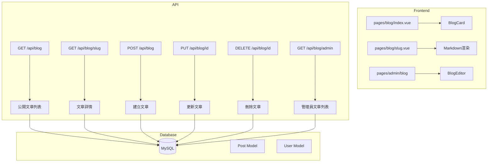
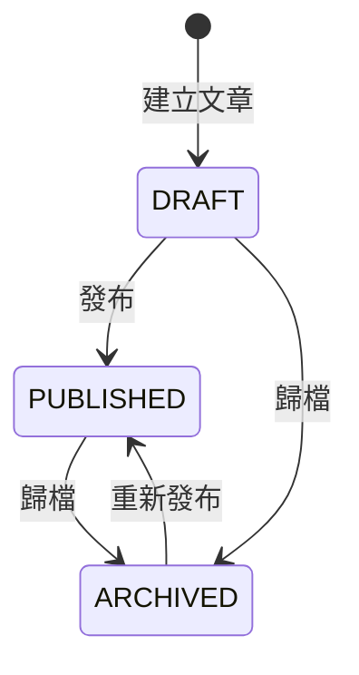

# 部落格系統審查報告

## 📋 系統概覽

這是一個建立在 Nuxt 3 上的投資教學部落格系統，整合在投資日記應用程式中。

### 技術棧
- **前端框架**: Nuxt 3 + Vue 3
- **資料庫**: MySQL + Prisma ORM
- **UI**: Tailwind CSS + NuxtImg
- **i18n**: @nuxtjs/i18n（支援 zh-TW, zh-CN, en）
- **Markdown**: MDC 元件渲染

---

## 🏗️ 系統架構



---

## 📁 檔案結構

### 前端頁面
| 檔案 | 用途 |
|------|------|
| [`pages/blog/index.vue`](pages/blog/index.vue) | 公開文章列表頁 |
| [`pages/blog/[slug].vue`](pages/blog/[slug].vue) | 文章詳情頁 |
| [`pages/admin/blog/index.vue`](pages/admin/blog/index.vue) | 管理員文章列表 |
| [`pages/admin/blog/new.vue`](pages/admin/blog/new.vue) | 新建文章頁 |
| [`pages/admin/blog/[id]/edit.vue`](pages/admin/blog/[id]/edit.vue) | 編輯文章頁 |

### 元件
| 檔案 | 用途 |
|------|------|
| [`components/BlogCard.vue`](components/BlogCard.vue) | 文章卡片元件 |
| [`components/BlogEditor.vue`](components/BlogEditor.vue) | 文章編輯器元件 |
| [`components/PostMeta.vue`](components/PostMeta.vue) | 文章元資訊元件 |
| [`components/CategoryFilter.vue`](components/CategoryFilter.vue) | 分類過濾元件 |

### API 端點
| 端點 | 方法 | 權限 | 用途 |
|------|------|------|------|
| `/api/blog` | GET | 公開 | 取得已發布文章列表 |
| `/api/blog/[slug]` | GET | 公開 | 取得文章詳情 |
| `/api/blog` | POST | Admin | 建立新文章 |
| `/api/blog/[id]` | PUT | Admin | 更新文章 |
| `/api/blog/[id]` | DELETE | Admin | 刪除文章 |
| `/api/blog/admin` | GET | Admin | 管理員文章列表 |
| `/api/blog/admin/[id]/publish` | POST | Admin | 發布文章 |
| `/api/blog/admin/[id]/archive` | POST | Admin | 歸檔文章 |

### 工具函式
| 檔案 | 函式 | 用途 |
|------|------|------|
| [`lib/blog.ts`](lib/blog.ts) | `generateSlug()` | 產生 URL slug |
| | `generateExcerpt()` | 產生文章摘要 |
| | `calculateReadingTime()` | 計算閱讀時間 |
| | `parseTags()` / `stringifyTags()` | 標籤處理 |

---

## 🗄️ 資料模型

```prisma
model Post {
  id          BigInt       @id @default(autoincrement())
  authorId    BigInt       @map("author_id")
  title       String       @db.VarChar(255)
  slug        String       @unique @db.VarChar(255)
  content     String       @db.Text
  excerpt     String?      @db.Text
  coverImage  String?      @db.VarChar(500) @map("cover_image")
  category    String       @db.VarChar(100)
  tags        String?      @db.VarChar(500)
  status      PostStatus   @default(DRAFT)
  publishedAt DateTime?    @map("published_at")
  createdAt   DateTime     @default(now())
  updatedAt   DateTime     @updatedAt

  author      User         @relation(...)
  
  @@index([authorId])
  @@index([status])
  @@index([publishedAt])
}
```

### PostStatus 狀態機



---

## ✅ 優點與良好實踐

### 1. 安全性
- ✅ 所有寫入操作都有 Admin 中間件保護
- ✅ 使用 BigInt 處理 ID，避免型別問題
- ✅ Slug 使用 unique 約束，防止衝突

### 2. 效能優化
- ✅ 列表 API 不回傳 content 欄位，減少傳輸量
- ✅ 資料庫索引完善（authorId, status, publishedAt）
- ✅ 圖片使用 NuxtImg 自動優化

### 3. SEO 友善
- ✅ 使用 slug 作為 URL，而非 ID
- ✅ 支援封面圖片
- ✅ 自動生成摘要

### 4. 開發體驗
- ✅ 完整的 TypeScript 型別定義
- ✅ 響應式表單元件（v-model 雙向綁定）
- ✅ 即時 Markdown 預覽

### 5. 國際化
- ✅ 完整的三語支援（zh-TW, zh-CN, en）
- ✅ 分類名稱支援翻譯

---

## ⚠️ 發現的問題與改進建議

### 🔴 高優先級

#### 1. 標籤搜尋效率問題
**問題**: 標籤以逗號分隔字串儲存，使用 `contains` 搜尋
```typescript
// server/api/blog/index.get.ts:28-32
if (tag) {
  where.tags = {
    contains: tag  // ❌ 可能匹配到部分字串
  }
}
```
**風險**: 搜尋「投資」會匹配到「長期投資」和「短期投資」
**建議**: 考慮使用 JSON 陣列或建立獨立的 Tag 表

#### 2. 分類值不一致
**問題**: 分類在多處硬編碼
- [`components/BlogEditor.vue:92-96`](components/BlogEditor.vue:92) - 使用中文值
- [`i18n/locales/zh-TW.json:529-534`](i18n/locales/zh-TW.json:529) - 翻譯鍵

```vue
<!-- BlogEditor.vue -->
<option value="基本面分析">{{ $t('blog.categories.fundamental') }}</option>
<option value="技术面分析">{{ $t('blog.categories.technical') }}</option>
```
**風險**: 維護困難，容易出現不一致
**建議**: 統一使用英文 key，在顯示時翻譯

#### 3. 閱讀時間計算不精確
**問題**: 使用字元數計算，未考慮中英文差異
```typescript
// lib/blog.ts:32-35
export function calculateReadingTime(content: string): number {
  const wordsPerMinute = 200
  const wordCount = content.length  // ❌ 中文字元數 ≠ 單詞數
  return Math.ceil(wordCount / wordsPerMinute)
}
```
**建議**: 中文字元應乘以權重，或使用專門的統計方法

### 🟡 中優先級

#### 4. 缺少草稿自動儲存
**問題**: 編輯器沒有自動儲存功能
**風險**: 使用者可能遺失未儲存的內容
**建議**: 加入 localStorage 暫存或定時自動儲存

#### 5. 缺少圖片上傳功能
**問題**: 封面圖片只接受 URL
```vue
<!-- BlogEditor.vue:70-78 -->
<input
  type="url"
  v-model="localCoverImage"
  :placeholder="$t('blog.coverImagePlaceholder')"
/>
```
**建議**: 整合檔案上傳功能

#### 6. 缺少文章版本控制
**問題**: 沒有文章修訂歷史
**建議**: 考慮加入 PostHistory 表追蹤變更

### 🟢 低優先級

#### 7. 缺少相關文章推薦
**建議**: 基於標籤或分類推薦相關文章

#### 8. 缺少文章瀏覽統計
**建議**: 加入 viewCount 欄位追蹤熱門文章

#### 9. 缺少 RSS/Atom Feed
**建議**: 為部落格加入訂閱功能

---

## 🚨 部署問題分析：資料庫重新初始化

### 問題描述
使用者反映資料庫在部署時經常被重新初始化。

### 根本原因分析

經過檢查以下檔案：
- [`docker-compose.yml`](docker-compose.yml)
- [`docker-entrypoint.sh`](docker-entrypoint.sh)
- [`Dockerfile`](Dockerfile)
- [`prisma/seed.ts`](prisma/seed.ts)

#### 可能的原因：

**1. MySQL Volume 未正確持久化**
```yaml
# docker-compose.yml:58-60
volumes:
  mysql_data:
    driver: local
```
- 如果使用 `docker-compose down -v` 會刪除 volume
- 如果在 CapRover 等平台部署，volume 名稱可能不同

**2. Seed 腳本問題**
```typescript
// prisma/seed.ts:7-11（已註解但危險）
// await prisma.transaction.deleteMany()
// await prisma.alert.deleteMany()
// await prisma.diary.deleteMany()
// await prisma.user.deleteMany()
```
- 雖然已註解，但如果有人取消註解會導致資料遺失

**3. Migration 重新執行**
```bash
# docker-entrypoint.sh:42
node ./node_modules/prisma/build/index.js migrate deploy
```
- `migrate deploy` 本身不會刪除資料
- 但如果有新的 migration 刪除表，就會影響資料

**4. CapRover/外部部署平台的 Volume 問題**
- 每次重新部署可能建立新的 volume
- 沒有正確掛載持久化儲存

### 建議解決方案

#### 方案 A：確保 Volume 持久化（推薦）
```yaml
# docker-compose.yml 修改
volumes:
  mysql_data:
    driver: local
    driver_opts:
      type: none
      o: bind
      device: /path/to/persistent/storage
```

#### 方案 B：使用外部 MySQL 服務
- 使用雲端 MySQL 服務（如 AWS RDS、GCP Cloud SQL）
- 或使用 CapRover 內建的 MySQL app

#### 方案 C：加入資料保護機制
```bash
# docker-entrypoint.sh 加入備份檢查
if [ "$BACKUP_BEFORE_MIGRATION" = "true" ]; then
    echo "📦 Creating database backup..."
    mysqldump -h "$DB_HOST" -u "$DB_USER" -p"$DB_PASS" "$DB_NAME" > /backup/pre-migration-$(date +%Y%m%d%H%M%S).sql
fi
```

### 檢查清單
- [ ] 確認部署平台（CapRover？）的 volume 持久化設定
- [ ] 檢查是否使用 `docker-compose down -v` 導致 volume 被刪除
- [ ] 確認 MySQL 資料目錄是否正確掛載
- [ ] 加入部署前自動備份機制

---

## 🧪 測試覆蓋率

現有測試檔案: [`tests/api/blog.test.ts`](tests/api/blog.test.ts)

### 已覆蓋
- ✅ GET /api/blog - 分頁與過濾
- ✅ GET /api/blog/[slug] - 文章詳情
- ✅ POST /api/blog - 建立文章
- ✅ PUT /api/blog/[id] - 更新文章
- ✅ DELETE /api/blog/[id] - 刪除文章

### 未覆蓋
- ❌ POST /api/blog/admin/[id]/publish
- ❌ POST /api/blog/admin/[id]/archive
- ❌ GET /api/blog/admin
- ❌ 前端元件測試

---

## 📊 程式碼品質指標

| 指標 | 評分 | 說明 |
|------|------|------|
| 程式碼組織 | ⭐⭐⭐⭐ | 結構清晰，職責分離 |
| 型別安全 | ⭐⭐⭐⭐ | 大部分有 TypeScript 型別 |
| 錯誤處理 | ⭐⭐⭐ | 基本錯誤處理，但缺少詳細錯誤訊息 |
| 測試覆蓋 | ⭐⭐⭐ | API 測試完整，缺少元件測試 |
| 文件 | ⭐⭐ | 程式碼註解較少 |
| i18n | ⭐⭐⭐⭐⭐ | 完整的多語言支援 |

---

## 🎯 改進優先順序建議

### 第一階段（建議立即處理）
1. 統一分類值管理
2. 修正閱讀時間計算
3. 改進標籤搜尋邏輯

### 第二階段（短期改進）
4. 加入草稿自動儲存
5. 完善測試覆蓋
6. 加入詳細錯誤訊息

### 第三階段（長期規劃）
7. 圖片上傳功能
8. 文章版本控制
9. 相關文章推薦
10. 瀏覽統計

---

## 📝 結論

這個部落格系統整體設計良好，具備基本功能且程式碼品質不錯。主要改進方向應該集中在：

1. **資料一致性** - 統一分類和標籤的管理方式
2. **使用者體驗** - 加入自動儲存和圖片上傳
3. **功能完善** - 版本控制、統計、推薦等進階功能

系統已經可以正常運作，建議根據實際使用需求逐步改進。
