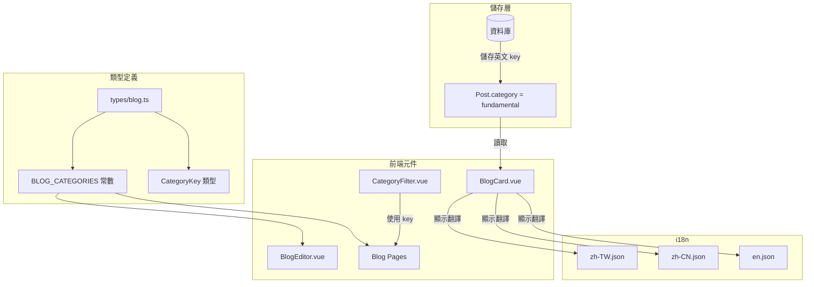

# Blog 分類值統一重構計劃

## 問題摘要

分類值在多處硬編碼，導致維護困難且容易出現不一致：

### 目前問題

1. **資料庫儲存中文值** - [`prisma/schema.prisma:131`](prisma/schema.prisma:131) 的 `category` 欄位儲存的是中文值
2. **前端硬編碼中文** - [`components/BlogEditor.vue:92-96`](components/BlogEditor.vue:92) 的 option value 使用中文
3. **多處重複定義對照表** - [`BlogCard.vue:145`](components/BlogCard.vue:145) 和 [`pages/blog/[slug].vue:212`](pages/blog/[slug].vue:212) 都有 categoryMap
4. **簡繁體不一致** - 儲存了「技术面分析」（簡體）和「技術面分析」（繁體）等不同變體

### 影響範圍

| 檔案 | 問題 |
|------|------|
| `components/BlogEditor.vue` | 硬編碼中文 option value |
| `components/BlogCard.vue` | categoryMap 反向對照 |
| `pages/blog/index.vue` | 多語言對照表定義 |
| `pages/blog/[slug].vue` | categoryMap 反向對照 |
| `pages/admin/blog/index.vue` | 多語言對照表定義 |
| `prisma/seed.ts` | 種子資料使用中文 |
| 資料庫現有資料 | 需要遷移 |

---

## 解決方案

### 架構設計



### 核心改動

#### 1. 建立統一的類型定義

**新建檔案**: `types/blog.ts`

```typescript
// 定義分類的英文 key
export const BLOG_CATEGORIES = {
  FUNDAMENTAL: 'fundamental',
  TECHNICAL: 'technical',
  MARKET: 'market',
  STRATEGY: 'strategy'
} as const

//衍生類型
export type CategoryKey = typeof BLOG_CATEGORIES[keyof typeof BLOG_CATEGORIES]

// 分類選項供 UI 使用
export const CATEGORY_OPTIONS: CategoryKey[] = [
  BLOG_CATEGORIES.FUNDAMENTAL,
  BLOG_CATEGORIES.TECHNICAL,
  BLOG_CATEGORIES.MARKET,
  BLOG_CATEGORIES.STRATEGY
]
```

#### 2. 修改 BlogEditor.vue

**修改前**:
```vue
<option value="基本面分析">{{ $t('blog.categories.fundamental') }}</option>
<option value="技术面分析">{{ $t('blog.categories.technical') }}</option>
```

**修改後**:
```vue
<option v-for="cat in CATEGORY_OPTIONS" :key="cat" :value="cat">
  {{ $t(`blog.categories.${cat}`) }}
</option>
```

#### 3. 修改 BlogCard.vue 顯示邏輯

**修改前**: 使用 categoryMap 反向查詢再翻譯

**修改後**: 直接使用 key 翻譯
```vue
{{ $t(`blog.categories.${post.category}`) }}
```

#### 4. 資料庫遷移

**遷移腳本**: 將現有中文值轉換為英文 key

```sql
UPDATE posts SET category = 'fundamental' WHERE category IN ('基本面分析', '基本面分析');
UPDATE posts SET category = 'technical' WHERE category IN ('技术面分析', '技術面分析', '技术面分析');
UPDATE posts SET category = 'market' WHERE category IN ('市场观察', '市場觀察', '市场观察');
UPDATE posts SET category = 'strategy' WHERE category IN ('投资策略', '投資策略', '投资策略');
```

---

## 實作步驟

### 階段一：類型定義與前端元件

1. [ ] 建立 `types/blog.ts` - 定義分類常數與類型
2. [ ] 修改 `components/BlogEditor.vue` - 使用英文 key
3. [ ] 修改 `pages/blog/index.vue` - 移除重複的對照表
4. [ ] 修改 `pages/admin/blog/index.vue` - 移除重複的對照表
5. [ ] 修改 `components/BlogCard.vue` - 直接使用 i18n 翻譯
6. [ ] 修改 `pages/blog/[slug].vue` - 移除 categoryMap

### 階段二：資料遷移

7. [ ] 建立資料庫遷移腳本
8. [ ] 更新 `prisma/seed.ts` 使用英文 key
9. [ ] 執行資料遷移

### 階段三：驗證

10. [ ] 測試所有頁面的分類顯示
11. [ ] 測試新文章建立
12. [ ] 測試文章編輯

---

## i18n 翻譯鍵（已存在，無需修改）

```json
// zh-TW.json
{
  "blog": {
    "categories": {
      "fundamental": "基本面分析",
      "technical": "技術面分析",
      "market": "市場觀察",
      "strategy": "投資策略"
    }
  }
}

// en.json
{
  "blog": {
    "categories": {
      "fundamental": "Fundamental Analysis",
      "technical": "Technical Analysis",
      "market": "Market Watch",
      "strategy": "Investment Strategy"
    }
  }
}
```

---

## 風險評估

| 風險 | 等級 | 緩解措施 |
|------|------|----------|
| 資料遷移失敗 | 中 | 先備份資料庫，在測試環境驗證|
| 遺漏的硬編碼 | 低 | 全域搜尋確保沒有遺漏 |
| 舊資料不相容 | 低 | 遷移腳本處理所有變體 |

---

## 預期成果

1. **統一性** - 所有分類使用英文 key，資料庫儲存一致
2. **可維護性** - 新增分類只需修改一處
3. **國際化友善** - 透過 i18n 自動支援多語言
4. **類型安全** - TypeScript 類型檢查防止拼寫錯誤
