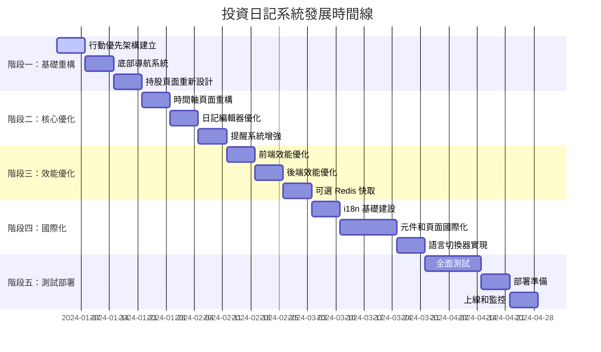

# 投資日記系統綜合發展路線圖

## 📋 專案概覽

### 系統現狀
- **技術棧**: Nuxt 3 + Vue 3 + TypeScript + MySQL + Prisma ORM + Tailwind CSS
- **核心功能**: 投資日記、持股管理、提醒系統、多用戶支援、PWA
- **現有問題**: 行動裝置體驗不佳、效能有待提升、缺乏國際化支援

### 發展目標
將系統從功能完整版本優化為以行動裝置體驗為核心的高效能應用程式，同時保持現有功能的完整性。

## 🎯 核心發展方向

### 1. 行動優先重設計
- 實現底部導航系統
- 觸控友好的操作介面
- 卡片式資訊呈現
- 手勢操作支援

### 2. 效能全面優化
- 前端資源優化（圖片、程式碼、CSS）
- 後端 API 效能提升（快取、查詢優化）
- 網路傳輸優化（壓縮、CDN）
- 可選 Redis 快取策略

### 3. 國際化支援
- 多語言介面（繁體中文、簡體中文、英文）
- 本地化日期和數字格式
- 語言切換功能

### 4. 使用者體驗提升
- 更直觀的視覺化介面
- 微互動和動畫效果
- 無障礙功能增強
- 離線功能優化

## 📅 實施時間線（16 週）



## 🏗️ 詳細實施計劃

### 階段一：基礎重構（第 1-3 週）

#### 第 1 週：行動優先架構建立
**目標：建立行動優先的基礎架構**

**技術任務：**
- [ ] 建立行動專用佈局系統
- [ ] 實現響應式偵測邏輯
- [ ] 建立底部導航基礎結構
- [ ] 實現浮動操作按鈕組件
- [ ] 設定行動專用的 CSS 變數

**交付成果：**
- 行動優先的基礎架構
- 響應式偵測系統
- 基礎導航元件

**關鍵檔案：**
```
layouts/mobile.vue
composables/useMobileDetection.ts
components/BottomNavigation.vue
components/FloatingActionButton.vue
```

#### 第 2 週：底部導航系統
**目標：實現完整的底部導航系統**

**技術任務：**
- [ ] 實現底部導航元件
- [ ] 加入導航狀態管理
- [ ] 實現導航動畫效果
- [ ] 整合現有路由系統
- [ ] 加入無障礙支援

**交付成果：**
- 完整的底部導航系統
- 導航狀態管理
- 動畫和互動效果

#### 第 3 週：持股頁面重新設計
**目標：重新設計持股頁面以適應行動裝置**

**技術任務：**
- [ ] 設計行動版持股卡片組件
- [ ] 實現觸控優化的操作
- [ ] 加入迷你圖表組件
- [ ] 實現卡片展開/收合功能
- [ ] 優化載入狀態顯示

**交付成果：**
- 行動優化的持股卡片
- 觸控友好的操作介面
- 迷你圖表組件

### 階段二：核心優化（第 4-6 週）

#### 第 4 週：時間軸頁面重構
**目標：重新設計時間軸頁面，提升行動體驗**

**技術任務：**
- [ ] 實現虛擬滾動組件
- [ ] 重新設計時間軸佈局
- [ ] 優化日期篩選功能
- [ ] 實現手勢操作支援
- [ ] 加入無限滾動載入

**交付成果：**
- 高效能的時間軸頁面
- 虛擬滾動實現
- 手勢操作支援

#### 第 5 週：日記編輯器優化
**目標：優化日記編輯器的行動體驗**

**技術任務：**
- [ ] 實現行動專用的 Markdown 編輯器
- [ ] 加入觸控優化的工具列
- [ ] 實現自動儲存功能
- [ ] 優化鍵盤彈出時的佈局
- [ ] 加入語音輸入支援

**交付成果：**
- 行動優化的編輯器
- 觸控友好的工具列
- 自動儲存功能

#### 第 6 週：提醒系統增強
**目標：增強提醒系統的行動體驗**

**技術任務：**
- [ ] 實現滑動操作功能
- [ ] 加入推播通知支援
- [ ] 優化提醒顯示佈局
- [ ] 實現快速操作選單
- [ ] 加入提醒範本功能

**交付成果：**
- 滑動操作的提醒列表
- 推播通知整合
- 快速操作功能

### 階段三：效能優化（第 7-9 週）

#### 第 7 週：前端效能優化
**目標：實施前端效能優化策略**

**技術任務：**
- [ ] 實施圖片懶載入和優化
- [ ] 優化 JavaScript 包大小
- [ ] 實施關鍵 CSS 內聯
- [ ] 加入資源預載策略
- [ ] 實施 Service Worker 快取

**交付成果：**
- 圖片優化系統
- 程式碼分割實現
- 快取策略實施

**關鍵配置：**
```typescript
// nuxt.config.ts
export default defineNuxtConfig({
  image: {
    format: ['webp', 'avif'],
    screens: { xs: 320, sm: 640, md: 768, lg: 1024, xl: 1280 }
  },
  experimental: {
    payloadExtraction: false,
    viewTransition: true
  }
})
```

#### 第 8 週：後端效能優化
**目標：優化後端 API 和資料庫效能**

**技術任務：**
- [ ] 實施可選 Redis 快取層
- [ ] 優化資料庫查詢
- [ ] 加入 API 回應快取
- [ ] 實施請求去重機制
- [ ] 優化資料庫連線池

**交付成果：**
- 可選 Redis 快取系統
- 查詢優化實現
- API 效能提升

#### 第 9 週：快取策略實施
**目標：實施完整的快取策略**

**技術任務：**
- [ ] 實現快取抽象層
- [ ] 建立 Redis/記憶體/無快取適配器
- [ ] 實現智慧快取管理器
- [ ] 加入快取健康檢查
- [ ] 實現快取監控端點

**交付成果：**
- 完整的快取系統
- 優雅降級機制
- 快取監控功能

### 階段四：國際化支援（第 10-13 週）

#### 第 10 週：i18n 基礎建設
**目標：建立國際化基礎設施**

**技術任務：**
- [ ] 安裝和配置 @nuxtjs/i18n
- [ ] 建立語言檔案結構
- [ ] 設計翻譯鍵值架構
- [ ] 實現語言檢測機制
- [ ] 配置路由策略

**交付成果：**
- i18n 基礎架構
- 語言檔案結構
- 翻譯鍵值設計

**關鍵配置：**
```typescript
// nuxt.config.ts
export default defineNuxtConfig({
  modules: ['@nuxtjs/i18n'],
  i18n: {
    locales: [
      { code: 'zh-TW', name: '繁體中文', file: 'zh-TW.json' },
      { code: 'zh-CN', name: '简体中文', file: 'zh-CN.json' },
      { code: 'en', name: 'English', file: 'en.json' }
    ],
    defaultLocale: 'zh-TW',
    lazy: true,
    langDir: 'i18n/locales',
    strategy: 'no_prefix'
  }
})
```

#### 第 11-12 週：元件和頁面國際化
**目標：將所有元件和頁面國際化**

**技術任務：**
- [ ] 更新導航相關元件
- [ ] 國際化認證頁面
- [ ] 國際化日記相關頁面
- [ ] 國際化持股和提醒頁面
- [ ] 國際化設定頁面
- [ ] 更新錯誤訊息

**交付成果：**
- 完全國際化的使用者介面
- 多語言錯誤訊息
- 本地化日期和數字格式

#### 第 13 週：語言切換器實現
**目標：實現語言切換功能**

**技術任務：**
- [ ] 建立語言切換器元件
- [ ] 實現語言偏好儲存
- [ ] 加入語言切換動畫
- [ ] 實現語言偵測邏輯
- [ ] 測試語言切換功能

**交付成果：**
- 語言切換器組件
- 語言偏好管理
- 完整的多語言體驗

### 階段五：測試和部署（第 14-16 週）

#### 第 14-15 週：全面測試
**目標：進行全面的測試和品質保證**

**技術任務：**
- [ ] 實施 E2E 測試
- [ ] 加入效能測試
- [ ] 進行跨裝置測試
- [ ] 實施可訪用性測試
- [ ] 進行國際化測試
- [ ] 進行使用者驗收測試

**交付成果：**
- 完整的測試套件
- 效能測試報告
- 跨裝置相容性驗證
- 國際化功能驗證

#### 第 16 週：部署準備和上線
**目標：準備生產環境部署並正式上線**

**技術任務：**
- [ ] 優化 Docker 映像
- [ ] 設定生產環境配置
- [ ] 實施藍綠部署
- [ ] 設定監控和日誌
- [ ] 準備回滾機制
- [ ] 執行生產環境部署
- [ ] 進行上線後驗證

**交付成果：**
- 成功的生產環境部署
- 運行中的監控系統
- 使用者回饋收集機制

## 🔧 技術架構設計

### 快取系統架構
```
┌─────────────────┐
│   應用程式層    │
├─────────────────┤
│   快取抽象層    │ ← 統一快取介面
├─────────────────┤
│  適配器層      │ ← Redis/記憶體/無快取
├─────────────────┤
│   儲存層       │ ← Redis/記憶體/直接查詢
└─────────────────┘
```

### 國際化架構
```
┌─────────────────┐
│   使用者介面    │
├─────────────────┤
│   i18n 層      │ ← 翻譯和本地化
├─────────────────┤
│   元件層       │ ← 多語言元件
├─────────────────┤
│   資料層       │ ← 本地化資料
└─────────────────┘
```

### 響應式設計斷點
```css
/* 行動優先設計 */
xs: 0px - 639px    /* 手機 */
sm: 640px - 767px  /* 大手機 */
md: 768px - 1023px /* 平板 */
lg: 1024px - 1279px /* 小型桌面 */
xl: 1280px+        /* 桌面 */
```

## 📊 成功指標

### 技術指標
- **Core Web Vitals**：FCP < 1.5s, LCP < 2.5s, FID < 100ms, CLS < 0.1
- **API 效能**：95% 的請求在 200ms 內完成
- **可用性**：99.9% 的系統可用性
- **測試覆蓋率**：80% 以上的程式碼覆蓋率

### 使用者體驗指標
- **行動裝置滿意度**：提升 40%
- **頁面載入時間**：減少 40%
- **核心功能使用頻率**：提升 30%
- **觸控效率**：減少 50% 的誤觸操作
- **多語言支援**：100% 的介面文字國際化

### 業務指標
- **使用者留存率**：提升 25%
- **功能完成率**：提升 30%
- **錯誤率**：降低 60%
- **支援請求**：減少 40%

## 🚨 風險評估與緩解

### 技術風險

#### 1. 效能回歸風險
**風險描述**：新功能可能影響現有效能
**緩解策略**：
- 實施效能預算機制
- 持續的效能監控
- 自動化效能測試

#### 2. 相容性風險
**風險描述**：新設計可能影響舊裝置
**緩解策略**：
- 漸進式增強策略
- 廣泛的裝置測試
- 優雅降級機制

#### 3. 快取一致性風險
**風險描述**：可選快取可能導致資料不一致
**緩解策略**：
- 實施快取失效機制
- 版本化快取鍵值
- 智慧快取更新

#### 4. 國際化複雜度風險
**風險描述**：多語言支援增加維護複雜度
**緩解策略**：
- 自動化翻譯檢查
- 統一的翻譯管理流程
- 社群貢獻機制

### 專案風險

#### 1. 時間延長風險
**風險描述**：功能複雜度高於預期
**緩解策略**：
- 分階段實施
- 定期進度評估
- 彈性的優先級調整

#### 2. 使用者接受度風險
**風險描述**：使用者可能不適應新介面
**緩解策略**：
- A/B 測試驗證
- 使用者教育計劃
- 漸進式推出

## 📁 關鍵交付文件

### 設計規範
- [`mobile-ui-design-specifications.md`](mobile-ui-design-specifications.md) - 行動 UI 設計規範
- [`performance-optimization-plan.md`](performance-optimization-plan.md) - 效能優化計劃
- [`optional-redis-cache-strategy.md`](optional-redis-cache-strategy.md) - 可選 Redis 快取策略

### 實施指南
- [`technical-implementation-roadmap.md`](technical-implementation-roadmap.md) - 技術實施路線圖
- [`i18n-implementation-plan.md`](i18n-implementation-plan.md) - 國際化實施計劃
- [`future-development-roadmap.md`](future-development-roadmap.md) - 未來發展路線圖

### 監控和測試
- 效能監控配置
- 測試套件和報告
- 部署檢查清單

## 🔄 持續改進計劃

### 短期改進（上線後 1-3 個月）
- 收集使用者回饋並優化
- 監控效能指標並調整
- 修復發現的問題和 bug
- 優化關鍵使用者路徑

### 中期改進（上線後 3-6 個月）
- 基於使用數據優化功能
- 新增使用者要求的次要功能
- 擴展國際化語言支援
- 優化行動裝置特定功能

### 長期改進（上線後 6-12 個月）
- 考慮新增進階分析功能
- 評估社群功能需求
- 探索 AI 輔助功能
- 準備下一個主要版本

---

*這個綜合發展路線圖將根據實施過程中的回饋和發現持續更新，確保專案成功達成所有目標*