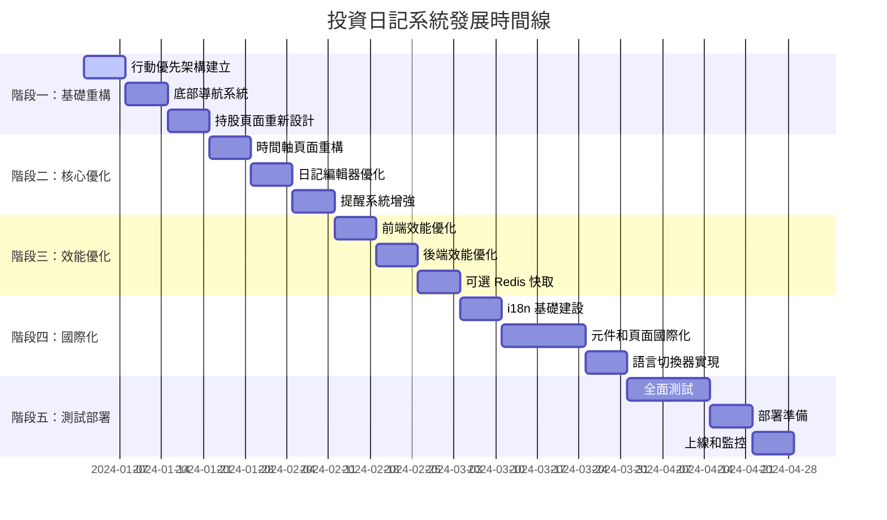

# 投資日記系統執行摘要

## 📋 專案概覽

### 系統現狀
- **技術棧**: Nuxt 3 + Vue 3 + TypeScript + MySQL + Prisma ORM + Tailwind CSS
- **核心功能**: 投資日記、持股管理、提醒系統、多用戶支援、PWA
- **現有問題**: 行動裝置體驗不佳、效能有待提升、缺乏國際化支援

### 發展目標
將系統從功能完整版本優化為以行動裝置體驗為核心的高效能應用程式，同時保持現有功能的完整性。

## 🎯 核心發展方向

### 1. 行動優先重設計
- 實現底部導航系統
- 觸控友好的操作介面
- 卡片式資訊呈現
- 手勢操作支援

### 2. 效能全面優化
- 前端資源優化（圖片、程式碼、CSS）
- 後端 API 效能提升（快取、查詢優化）
- 網路傳輸優化（壓縮、CDN）
- 可選 Redis 快取策略

### 3. 國際化支援
- 多語言介面（繁體中文、簡體中文、英文）
- 本地化日期和數字格式
- 語言切換功能

### 4. 使用者體驗提升
- 更直觀的視覺化介面
- 微互動和動畫效果
- 無障礙功能增強
- 離線功能優化

## 📅 實施時間線（16 週）



## 🏗️ 關鍵實施階段

### 階段一：基礎重構（第 1-3 週）
**目標：建立行動優先的基礎架構**

**主要交付成果：**
- 行動專用佈局系統
- 響應式偵測邏輯
- 底部導航系統
- 浮動操作按鈕
- 行動優化的持股頁面

**關鍵檔案：**
```
layouts/mobile.vue
composables/useMobileDetection.ts
components/BottomNavigation.vue
components/FloatingActionButton.vue
components/HoldingCard.vue
```

### 階段二：核心優化（第 4-6 週）
**目標：優化核心功能的使用者體驗**

**主要交付成果：**
- 虛擬滾動時間軸
- 行動優化的編輯器
- 增強的提醒系統
- 手勢操作支援
- 無限滾動載入

**關鍵檔案：**
```
components/VirtualScroller.vue
components/TimelineView.vue
components/MobileDiaryEditor.vue
components/EditorToolbar.vue
components/SwipeableList.vue
```

### 階段三：效能優化（第 7-9 週）
**目標：全面提升系統效能**

**主要交付成果：**
- 圖片優化和懶載入
- 程式碼分割和優化
- 可選 Redis 快取系統
- API 效能優化
- Service Worker 快取

**關鍵檔案：**
```
nuxt.config.ts
lib/cache/manager.ts
plugins/image-optimization.ts
plugins/service-worker.ts
```

### 階段四：國際化支援（第 10-13 週）
**目標：實現完整的多語言支援**

**主要交付成果：**
- i18n 基礎架構
- 多語言介面
- 語言切換器
- 本地化日期和數字
- 翻譯管理工具

**關鍵檔案：**
```
i18n/locales/
components/LanguageSwitcher.vue
composables/useLanguagePreference.ts
```

### 階段五：測試和部署（第 14-16 週）
**目標：確保品質並成功部署**

**主要交付成果：**
- 全面測試套件
- 生產環境部署
- 監控和警報系統
- 使用者回饋機制
- 自動化部署流程

**關鍵檔案：**
```
tests/
scripts/deploy/
plugins/continuous-monitoring.ts
```

## 📊 成功指標

### 技術指標
- **Core Web Vitals**：FCP < 1.5s, LCP < 2.5s, FID < 100ms, CLS < 0.1
- **API 效能**：95% 的請求在 200ms 內完成
- **可用性**：99.9% 的系統可用性
- **測試覆蓋率**：80% 以上的程式碼覆蓋率

### 使用者體驗指標
- **行動裝置滿意度**：提升 40%
- **頁面載入時間**：減少 40%
- **觸控效率**：減少 50% 的誤觸操作
- **多語言支援**：100% 的介面文字國際化

### 業務指標
- **使用者留存率**：提升 25%
- **功能完成率**：提升 30%
- **錯誤率**：降低 60%
- **支援請求**：減少 40%

## 🚨 風險管理

### 高風險項目

#### 1. 效能回歸風險
- **影響**：使用者體驗下降
- **機率**：中等
- **緩解**：持續效能監控、效能預算機制、自動化效能測試

#### 2. 相容性風險
- **影響**：舊裝置無法使用
- **機率**：中等
- **緩解**：漸進式增強策略、廣泛裝置測試、優雅降級機制

#### 3. 時間延長風險
- **影響**：專案延期
- **機率**：高
- **緩解**：彈性計劃調整、分階段實施、定期進度評估

#### 4. 快取一致性風險
- **影響**：資料不一致
- **機率**：低
- **緩解**：智慧快取策略、快取失效機制、版本化快取鍵值

#### 5. 國際化複雜度風險
- **影響**：維護困難
- **機率**：中等
- **緩解**：清晰架構設計、自動化翻譯檢查、統一翻譯管理流程

## 📁 關鍵交付文件

### 主要實施文件
1. [`unified-implementation-roadmap.md`](unified-implementation-roadmap.md) - 統一的實施路線圖
2. [`comprehensive-development-roadmap.md`](comprehensive-development-roadmap.md) - 綜合發展路線圖
3. [`detailed-implementation-tasks.md`](detailed-implementation-tasks.md) - 詳細任務實施指南
4. [`implementation-workflow.md`](implementation-workflow.md) - 實施工作流程
5. [`project-execution-guide.md`](project-execution-guide.md) - 項目執行指南

### 設計規範文件
1. [`mobile-ui-design-specifications.md`](mobile-ui-design-specifications.md) - 行動 UI 設計規範
2. [`performance-optimization-plan.md`](performance-optimization-plan.md) - 效能優化計劃
3. [`optional-redis-cache-strategy.md`](optional-redis-cache-strategy.md) - 可選 Redis 快取策略
4. [`i18n-implementation-plan.md`](i18n-implementation-plan.md) - 國際化實施計劃

## 🔄 持續改進計劃

### 短期改進（上線後 1-3 個月）
- 收集使用者回饋並優化
- 監控效能指標並調整
- 修復發現的問題和 bug
- 優化關鍵使用者路徑

### 中期改進（上線後 3-6 個月）
- 基於使用數據優化功能
- 新增使用者要求的次要功能
- 擴展國際化語言支援
- 優化行動裝置特定功能

### 長期改進（上線後 6-12 個月）
- 考慮社群功能需求
- 探索 AI 輔助功能
- 準備下一個主要版本

## 📋 執行檢查清單

### 每週檢查項目
- [ ] 進度評估和調整
- [ ] 風險識別和緩解
- [ ] 品質保證檢查
- [ ] 團隊協調和溝通

### 每階段檢查項目
- [ ] 交付成果驗證
- [ ] 效能指標檢查
- [ ] 使用者體驗測試
- [ ] 文件更新和維護

### 上線前檢查項目
- [ ] 全面測試完成
- [ ] 效能基準達成
- [ ] 安全性掃描通過
- [ ] 部署準備就緒
- [ ] 監控系統運行
- [ ] 回滾機制測試

---

*此執行摘要將根據實際執行情況和回饋持續更新，確保專案成功達成所有目標*