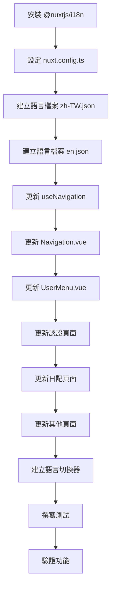

# i18n 國際化實作計劃

## 專案現狀分析

### 技術棧
- **框架**: Nuxt 4.3.1 + Vue 3.5
- **UI**: TailwindCSS
- **資料庫**: Prisma + PostgreSQL
- **現有 i18n**: 無（所有文字為硬編碼繁體中文）

### 需要國際化的範圍

#### 1. 元件 (Components)
| 檔案 | 需翻譯內容 |
|------|-----------|
| [`Navigation.vue`](components/Navigation.vue) | 品牌名稱、aria-label、按鈕文字 |
| [`UserMenu.vue`](components/UserMenu.vue) | 選單項目、aria-label |
| [`Toast.vue`](components/Toast.vue) | 關閉按鈕 sr-only 文字 |
| [`DiaryEditor.vue`](components/DiaryEditor.vue) | 編輯器標籤、按鈕、placeholder |
| [`AlertNotification.vue`](components/AlertNotification.vue) | 通知訊息 |
| [`TransactionInput.vue`](components/TransactionInput.vue) | 表單標籤、按鈕 |
| [`HealthStatus.vue`](components/HealthStatus.vue) | 狀態文字 |

#### 2. 頁面 (Pages)
| 路徑 | 需翻譯內容 |
|------|-----------|
| [`/auth/login`](pages/auth/login.vue) | 標題、表單標籤、按鈕、連結 |
| [`/auth/register`](pages/auth/register.vue) | 標題、表單標籤、按鈕、連結 |
| [`/diaries`](pages/diaries/index.vue) | 標題、篩選器、排序選項、狀態文字 |
| [`/diaries/new`](pages/diaries/new.vue) | 標題、表單標籤、按鈕 |
| [`/diaries/[id]`](pages/diaries/[id]/index.vue) | 日記詳情相關文字 |
| [`/diaries/[id]/edit`](pages/diaries/[id]/edit.vue) | 編輯頁面相關文字 |
| [`/alerts`](pages/alerts/index.vue) | 標題、狀態文字、按鈕 |
| [`/stocks`](pages/stocks/index.vue) | 標題、表格標頭、按鈕 |
| [`/settings`](pages/settings/index.vue) | 標題、表單標籤、按鈕、說明文字 |
| [`/timeline`](pages/timeline/index.vue) | 標題、時間軸相關文字 |
| [`/`](pages/index.vue) | 首頁月曆相關文字 |

#### 3. Composables
| 檔案 | 需翻譯內容 |
|------|-----------|
| [`useNavigation.ts`](composables/useNavigation.ts) | 導航項目標籤（月曆、時間軸、日記列表等） |

#### 4. 伺服器端 API 錯誤訊息
- 認證相關錯誤（登入失敗、註冊失敗等）
- 資料驗證錯誤
- 權限錯誤

---

## 實作計劃

### 階段一：基礎建設

#### 1.1 安裝 @nuxtjs/i18n 模組
```bash
npm install @nuxtjs/i18n
```

#### 1.2 設定 nuxt.config.ts
```typescript
export default defineNuxtConfig({
  modules: [
    '@nuxtjs/tailwindcss',
    '@nuxtjs/mdc',
    '@nuxt/icon',
    '@nuxtjs/color-mode',
    '@nuxtjs/i18n'  // 新增
  ],

  i18n: {
    locales: [
      { code: 'zh-TW', name: '繁體中文', file: 'zh-TW.json' },
      { code: 'en', name: 'English', file: 'en.json' }
    ],
    defaultLocale: 'zh-TW',
    lazy: true,
    langDir: 'locales',
    strategy: 'no_prefix',  // URL 不加語言前綴
    detectBrowserLanguage: {
      useCookie: true,
      cookieKey: 'i18n_locale',
      fallbackLocale: 'zh-TW'
    }
  }
})
```

#### 1.3 建立語言檔案結構
```
i18n/
└── locales/
    ├── zh-TW.json    # 繁體中文（預設）
    └── en.json       # 英文
```

---

### 階段二：翻譯鍵值架構設計

建議採用巢狀結構組織翻譯鍵值：

```json
{
  "common": {
    "appName": "投資日記",
    "loading": "載入中...",
    "save": "儲存",
    "cancel": "取消",
    "delete": "刪除",
    "edit": "編輯",
    "create": "新增",
    "search": "搜尋",
    "close": "關閉",
    "confirm": "確認",
    "back": "返回"
  },
  
  "nav": {
    "calendar": "月曆",
    "timeline": "時間軸",
    "diaries": "日記列表",
    "alerts": "提醒管理",
    "stocks": "股票管理"
  },
  
  "auth": {
    "login": "登入",
    "logout": "登出",
    "register": "註冊",
    "loginTitle": "登入您的帳戶",
    "registerTitle": "建立新帳戶",
    "createAccount": "建立新帳戶",
    "email": "電子郵件",
    "password": "密碼",
    "confirmPassword": "確認密碼",
    "name": "姓名",
    "loggingIn": "登入中...",
    "registering": "註冊中...",
    "orCreateAccount": "或建立新帳戶",
    "alreadyHaveAccount": "已有帳戶？登入",
    "loggedInAs": "已登入為"
  },
  
  "diary": {
    "title": "日記列表",
    "newDiary": "新增日記",
    "editDiary": "編輯日記",
    "writeDiary": "寫日記",
    "searchPlaceholder": "搜尋標題或內容...",
    "dateFrom": "開始日期",
    "dateTo": "結束日期",
    "sortBy": "排序方式",
    "dateDesc": "日期（新到舊）",
    "dateAsc": "日期（舊到新）",
    "titleAsc": "標題（A-Z）",
    "titleDesc": "標題（Z-A）",
    "clearFilters": "清除篩選",
    "resultsFound": "找到 {count} 筆結果",
    "loadFailed": "載入失敗",
    "noDiaries": "尚無日記",
    "createFirst": "開始撰寫您的第一篇投資日記"
  },
  
  "alert": {
    "title": "提醒管理",
    "markAsRead": "標記為已讀",
    "markedAsRead": "提醒已標記為已讀",
    "noAlerts": "尚無有效提醒",
    "noAlertsDesc": "所有提醒皆已處理或尚未建立。",
    "viewRelatedDiary": "查看關聯日記",
    "triggerTime": "觸發時間",
    "createdAt": "建立於"
  },
  
  "stock": {
    "title": "股票管理",
    "holdings": "持倉",
    "noHoldings": "尚無持倉"
  },
  
  "settings": {
    "title": "帳戶設定",
    "profile": "個人資料",
    "tradingSettings": "交易設定",
    "emailCannotChange": "電子郵件無法修改",
    "expectedMonthlyTrades": "預計每月交易次數",
    "expectedMonthlyTradesDesc": "設定您預計每個月進行的交易次數",
    "expectedProfit": "預期利潤",
    "expectedProfitDesc": "您每個月的預期獲利目標",
    "expectedAvgHolding": "預期平均持倉金額",
    "changePassword": "變更密碼",
    "currentPassword": "目前密碼",
    "newPassword": "新密碼",
    "confirmNewPassword": "確認新密碼",
    "passwordChanged": "密碼已更新"
  },
  
  "theme": {
    "toggleDarkMode": "切換深色模式",
    "openMenu": "開啟選單"
  },
  
  "error": {
    "unauthorized": "未授權，請先登入",
    "invalidCredentials": "電子郵件或密碼錯誤",
    "emailExists": "此電子郵件已被註冊",
    "validationError": "資料驗證失敗",
    "unknown": "發生未知錯誤"
  }
}
```

---

### 階段三：元件更新

#### 3.1 更新 useNavigation.ts
```typescript
export const useNavigation = () => {
  const { t } = useI18n()
  const { isAuthenticated } = useAuth()
  const route = useRoute()

  const navItems = computed<NavItem[]>(() => [
    { label: t('nav.calendar'), to: '/' },
    { label: t('nav.timeline'), to: '/timeline', auth: true },
    { label: t('nav.diaries'), to: '/diaries', auth: true },
    { label: t('nav.alerts'), to: '/alerts', auth: true },
    { label: t('nav.stocks'), to: '/stocks', auth: true }
  ])
  // ...
}
```

#### 3.2 更新 Navigation.vue 模板
```vue
<template>
  <!-- ... -->
  <NuxtLink to="/" class="text-xl font-bold text-gray-800 dark:text-white">
    {{ $t('common.appName') }}
  </NuxtLink>
  <!-- ... -->
  <button :aria-label="$t('theme.toggleDarkMode')">
  <!-- ... -->
  <NuxtLink to="/auth/login">
    {{ $t('auth.login') }}
  </NuxtLink>
  <NuxtLink to="/auth/register">
    {{ $t('auth.register') }}
  </NuxtLink>
</template>
```

---

### 階段四：語言切換器元件

建立 [`components/LanguageSwitcher.vue`](components/LanguageSwitcher.vue)：

```vue
<script setup lang="ts">
const { locale, locales, setLocale } = useI18n()

const availableLocales = computed(() => 
  locales.value.filter(l => l.code !== locale.value)
)
</script>

<template>
  <div class="relative">
    <button 
      class="p-2 rounded-lg text-gray-500 hover:bg-gray-100 dark:text-gray-400 dark:hover:bg-gray-700"
      :aria-label="$t('common.switchLanguage')"
    >
      <Icon name="heroicons:language" class="h-5 w-5" />
    </button>
    <!-- Dropdown with language options -->
  </div>
</template>
```

---

### 階段五：伺服器端 i18n（選用）

對於 API 錯誤訊息，有兩種策略：

**策略 A：HTTP 狀態碼 + 客戶端翻譯**
- API 回傳錯誤代碼
- 客戶端根據代碼顯示對應翻譯

**策略 B：Accept-Language 標頭**
- 伺服器根據請求標頭回傳對應語言的錯誤訊息

建議採用 **策略 A**，更簡單且與前端一致。

---

## 實作順序



---

## 檔案變更清單

### 新增檔案
| 檔案 | 說明 |
|------|------|
| `i18n/locales/zh-TW.json` | 繁體中文翻譯 |
| `i18n/locales/en.json` | 英文翻譯 |
| `components/LanguageSwitcher.vue` | 語言切換器元件 |
| `tests/i18n.test.ts` | i18n 測試 |

### 修改檔案
| 檔案 | 變更內容 |
|------|---------|
| `package.json` | 新增 @nuxtjs/i18n 依賴 |
| `nuxt.config.ts` | 新增 i18n 模組與配置 |
| `composables/useNavigation.ts` | 使用 i18n 翻譯 |
| `components/Navigation.vue` | 使用 $t() 函數 |
| `components/UserMenu.vue` | 使用 $t() 函數 |
| `components/Toast.vue` | 使用 $t() 函數 |
| `pages/auth/login.vue` | 使用 $t() 函數 |
| `pages/auth/register.vue` | 使用 $t() 函數 |
| `pages/diaries/index.vue` | 使用 $t() 函數 |
| `pages/diaries/new.vue` | 使用 $t() 函數 |
| `pages/diaries/[id]/index.vue` | 使用 $t() 函數 |
| `pages/diaries/[id]/edit.vue` | 使用 $t() 函數 |
| `pages/alerts/index.vue` | 使用 $t() 函數 |
| `pages/stocks/index.vue` | 使用 $t() 函數 |
| `pages/settings/index.vue` | 使用 $t() 函數 |
| `pages/timeline/index.vue` | 使用 $t() 函數 |
| `pages/index.vue` | 使用 $t() 函數 |

---

## 注意事項

1. **SEO 考量**: 使用 `strategy: 'no_prefix'` 可避免 URL 變得複雜，但若未來需要 SEO 多語言，應改用 `prefix_except_default`

2. **日期格式**: 使用 date-fns 的 locale 功能處理日期格式化
   ```typescript
   import { format } from 'date-fns'
   import { zhTW, enUS } from 'date-fns/locale'
   
   const { locale } = useI18n()
   const dateLocale = computed(() => locale.value === 'zh-TW' ? zhTW : enUS)
   ```

3. **數字格式**: 使用 `Intl.NumberFormat` 處理貨幣和數字格式

4. **複數處理**: @nuxtjs/i18n 支援複數形式，例如：
   ```json
   "resultsFound": "找到 {count} 筆結果 | 找到 {count} 筆結果"
   ```

5. **測試**: 確保切換語言時所有文字正確顯示，且不影響功能

---

## 預估工作量

| 階段 | 工作項目 |
|------|---------|
| 階段一 | 基礎建設（安裝、配置、語言檔案） |
| 階段二 | 翻譯鍵值設計與翻譯撰寫 |
| 階段三 | 元件更新 |
| 階段四 | 頁面更新 |
| 階段五 | 語言切換器與測試 |
