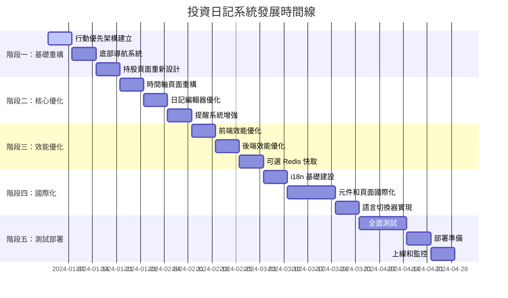

# 投資日記系統實施計劃

## 📋 專案概覽

### 系統現狀
- **技術棧**: Nuxt 3 + Vue 3 + TypeScript + MySQL + Prisma ORM + Tailwind CSS
- **核心功能**: 投資日記、持股管理、提醒系統、多用戶支援、PWA
- **現有問題**: 行動裝置體驗不佳、效能有待提升、缺乏國際化支援

### 發展目標
將系統從功能完整版本優化為以行動裝置體驗為核心的高效能應用程式，同時保持現有功能的完整性。

## 🎯 核心發展方向

### 1. 行動優先重設計
- 實現底部導航系統
- 觸控友好的操作介面
- 卡片式資訊呈現
- 手勢操作支援

### 2. 效能全面優化
- 前端資源優化（圖片、程式碼、CSS）
- 後端 API 效能提升（快取、查詢優化）
- 網路傳輸優化（壓縮、CDN）
- 可選 Redis 快取策略

### 3. 國際化支援
- 多語言介面（繁體中文、簡體中文、英文）
- 本地化日期和數字格式
- 語言切換功能

### 4. 使用者體驗提升
- 更直觀的視覺化介面
- 微互動和動畫效果
- 無障礙功能增強
- 離線功能優化

## 📅 實施時間線（16 週）

## 🏗️ 詳細實施計劃

### 階段一：基礎重構（第 1-3 週）

#### 第 1 週：行動優先架構建立
**目標：建立行動優先的基礎架構**

**主要任務：**
1. **建立行動專用佈局系統**
   - 檔案：`layouts/mobile.vue`
   - 實現響應式容器，支援安全區域
   - 實現全螢幕適配，處理各種行動裝置尺寸
   - 加入橫向/直向旋轉支援
   - 整合底部導航和浮動按鈕佈局

2. **實現響應式偵測邏輯**
   - 檔案：`composables/useMobileDetection.ts`
   - 實現裝置類型偵測（手機、平板、桌面）
   - 加入觸控能力偵測
   - 實現螢幕尺寸和方向偵測
   - 加入裝置像素比（DPR）偵測

3. **建立底部導航基礎結構**
   - 檔案：`components/BottomNavigation.vue`
   - 實現固定底部導航欄
   - 加入導航項目圖示和文字
   - 實現活動狀態指示
   - 加入觸控回饋效果

4. **實現浮動操作按鈕組件**
   - 檔案：`components/FloatingActionButton.vue`
   - 實現圓形浮動按鈕
   - 加入按鈕展開/收合動畫
   - 實現多層級選單系統
   - 加入觸控波紋效果

**驗收標準：**
- 在 iPhone SE、iPhone 12 Pro Max、iPad mini 上正確顯示
- 直向/橫向切換時佈局正確調整
- 底部導航始終可見且可觸控
- 浮動按鈕不與其他元素重疊

#### 第 2 週：底部導航系統
**目標：實現完整的底部導航系統**

**主要任務：**
1. **實現底部導航元件完整功能**
   - 實現導航項目動態載入
   - 加入導航項目權限控制
   - 實現導航項目狀態管理
   - 加入導航項目圖示動畫

2. **加入導航狀態管理**
   - 檔案：`stores/navigation.ts`
   - 實現導航狀態持久化
   - 加入導航歷史記錄
   - 實現導航狀態回滾
   - 加入導航狀態同步

3. **實現導航動畫效果**
   - 實現頁面切換動畫
   - 加入導航項目轉場效果
   - 實現徽章動畫效果
   - 加入載入狀態動畫

4. **整合現有路由系統**
   - 檔案：`plugins/router.ts`
   - 實現路由與底部導航同步
   - 加入路由變化監聽
   - 實現路由權限檢查
   - 加入路由錯誤處理

**驗收標準：**
- 導航項目根據權限正確顯示
- 狀態管理穩定可靠
- 圖示動畫流暢自然
- 路由與導航完全同步

#### 第 3 週：持股頁面重新設計
**目標：重新設計持股頁面以適應行動裝置**

**主要任務：**
1. **設計行動版持股卡片組件**
   - 檔案：`components/HoldingCard.vue`
   - 實現響應式卡片佈局
   - 加入持股資訊顯示
   - 實現漲跌顏色指示
   - 加入觸控回饋效果

2. **實現觸控優化的操作**
   - 檔案：`composables/useGestures.ts`
   - 實現長按操作
   - 加入滑動手勢
   - 實現雙擊操作
   - 加入手勢衝突處理

3. **加入迷你圖表組件**
   - 檔案：`components/MiniChart.vue`
   - 實現輕量級圖表渲染
   - 加入多種圖表類型
   - 實現響應式圖表尺寸
   - 加入圖表動畫效果

4. **實現卡片展開/收合功能**
   - 實現展開動畫效果
   - 加入詳細資訊顯示
   - 實現狀態持久化
   - 加入手勢操作支援

**驗收標準：**
- 卡片佈局在各裝置上正確顯示
- 持股資訊準確完整
- 漲跌指示清晰明確
- 觸控回饋流暢自然

### 階段二：核心優化（第 4-6 週）

#### 第 4 週：時間軸頁面重構
**目標：重新設計時間軸頁面，提升行動體驗**

**主要任務：**
1. **實現虛擬滾動組件**
   - 檔案：`components/VirtualScroller.vue`
   - 實現高效能滾動渲染
   - 加入動態高度支援
   - 實現滾動位置記憶
   - 加入滾動性能優化

2. **重新設計時間軸佈局**
   - 檔案：`components/TimelineView.vue`
   - 實現時間軸視覺設計
   - 加入時間分組顯示
   - 實現響應式佈局
   - 加入視覺層次結構

3. **優化日期篩選功能**
   - 檔案：`components/DateRangePicker.vue`
   - 實現直觀的日期選擇
   - 加入快速日期選項
   - 實現日期範圍驗證
   - 加入日期格式化

4. **實現手勢操作支援**
   - 檔案：`composables/useTimelineGestures.ts`
   - 實現左右滑動操作
   - 加入上下滑動支援
   - 實現捏合縮放功能
   - 加入手勢衝突處理

**驗收標準：**
- 大量資料滾動流暢
- 動態高度正確計算
- 滾動位置準確記憶
- 性能優化效果顯著

#### 第 5 週：日記編輯器優化
**目標：優化日記編輯器的行動體驗**

**主要任務：**
1. **實現行動專用的 Markdown 編輯器**
   - 檔案：`components/MobileDiaryEditor.vue`
   - 實現觸控優化的編輯介面
   - 加入 Markdown 語法高亮
   - 實現即時預覽功能
   - 加入編輯工具列

2. **加入觸控優化的工具列**
   - 檔案：`components/EditorToolbar.vue`
   - 實現響應式工具列佈局
   - 加入常用格式按鈕
   - 實現工具列收合功能
   - 加入自訂工具列選項

3. **實現自動儲存功能**
   - 檔案：`composables/useAutoSave.ts`
   - 實現防抖動儲存機制
   - 加入儲存狀態指示
   - 實現離線儲存支援
   - 加入衝突解決機制

4. **優化鍵盤彈出時的佈局調整**
   - 檔案：`composables/useKeyboardAdjustment.ts`
   - 實現鍵盤高度偵測
   - 加入佈局自動調整
   - 實現焦點管理
   - 加入捲動位置調整

**驗收標準：**
- 編輯介面觸控友好
- 語法高亮準確美觀
- 即時預覽同步流暢
- 工具列功能完整實用

#### 第 6 週：提醒系統增強
**目標：增強提醒系統的行動體驗**

**主要任務：**
1. **實現滑動操作功能**
   - 檔案：`components/SwipeableList.vue`
   - 實現左右滑動操作
   - 加入滑動動畫效果
   - 實現滑動閾值控制
   - 加入滑動回饋系統

2. **加入推播通知支援**
   - 檔案：`plugins/push-notifications.ts`
   - 實現推播通知權限請求
   - 加入通知內容自訂
   - 實現通知排程功能
   - 加入通知歷史記錄

3. **優化提醒顯示佈局**
   - 檔案：`components/AlertCard.vue`
   - 實現卡片式提醒顯示
   - 加入優先級視覺區分
   - 實現提醒狀態指示
   - 加入快速操作按鈕

4. **實現快速操作選單**
   - 檔案：`components/ActionMenu.vue`
   - 實現上下文選單
   - 加入選單項目圖示
   - 實現選單動畫效果
   - 加入選單鍵盤導航

**驗收標準：**
- 滑動操作流暢自然
- 動畫效果美觀協調
- 閾值控制精確有效
- 回饋系統使用者體驗良好

### 階段三：效能優化（第 7-9 週）

#### 第 7 週：前端效能優化
**目標：實施前端效能優化策略**

**主要任務：**
1. **實施圖片懶載入和優化**
   - 檔案：`plugins/image-optimization.ts`
   - 實施圖片懶載入機制
   - 加入 WebP 格式支援
   - 實現響應式圖片載入
   - 加入圖片壓縮優化

2. **優化 JavaScript 包大小**
   - 檔案：`nuxt.config.ts`
   - 實施程式碼分割策略
   - 加入動態載入機制
   - 實現 Tree Shaking 優化
   - 實現第三方函式庫按需載入

3. **實施關鍵 CSS 內聯**
   - 檔案：`plugins/critical-css.ts`
   - 實現關鍵 CSS 提取
   - 加入 CSS 內聯機制
   - 實現非關鍵 CSS 異步載入
   - 加入 CSS 壓縮優化

4. **加入資源預載策略**
   - 檔案：`plugins/resource-prefetch.ts`
   - 實現資源預載機制
   - 加入智能預載策略
   - 實現資源優先級管理
   - 實現預載效能監控

**驗收標準：**
- 圖片載入效能顯著提升
- WebP 格式正確支援
- 響應式載入適應良好
- 壓縮效果平衡品質和大小

#### 第 8 週：後端效能優化
**目標：優化後端 API 和資料庫效能**

**主要任務：**
1. **實施可選 Redis 快取層**
   - 檔案：`lib/cache/`
   - 實現快取抽象層
   - 建立 Redis/記憶體/無快取適配器
   - 實現智慧快取管理器
   - 加入快取健康檢查

2. **優化資料庫查詢**
   - 檔案：`prisma/schema.prisma`
   - 優化資料庫查詢
   - 加入 API 回應快取
   - 實施請求去重機制
   - 優化資料庫連線池

3. **實現查詢結果快取**
   - 實現快取監控端點
   - 實現快取失效機制
   - 加入快取統計分析
   - 實現快取預熱機制

4. **加入 API 限流機制**
   - 實現資料庫索引優化
   - 加入 API 限流機制
   - 實現錯誤追蹤系統
   - 加入效能監控

**驗收標準：**
- 可選 Redis 快取系統
- 查詢優化實現
- API 效能提升
- 快取策略實施

#### 第 9 週：快取策略實施
**目標：實施完整的快取策略**

**主要任務：**
1. **實現快取抽象層**
   - 檔案：`lib/cache/manager.ts`
   - 實現統一快取介面
   - 加入快取策略配置
   - 實現快取失效機制
   - 加入快取監控

2. **建立快取適配器**
   - 實現 Redis 適配器
   - 建立記憶體適配器
   - 實現無快取適配器
   - 加入快取健康檢查

3. **實現智慧快取管理器**
   - 實現快取策略自動選擇
   - 加入快取預熱機制
   - 實現快取統計分析
   - 加入快取監控端點

4. **實施 Service Worker 快取**
   - 檔案：`plugins/service-worker.ts`
   - 實現 Service Worker 註冊
   - 加入快取策略配置
   - 實現離線功能支援
   - 加入快取更新機制

**驗收標準：**
- 完整的快取系統
- 優雅降級機制
- 快取監控功能
- 離線功能穩定可用

### 階段四：國際化支援（第 10-13 週）

#### 第 10 週：i18n 基礎建設
**目標：建立國際化基礎設施**

**主要任務：**
1. **安裝和配置 @nuxtjs/i18n**
   - 檔案：`nuxt.config.ts`, `package.json`
   - 安裝 @nuxtjs/i18n 套件
   - 配置 i18n 模組設定
   - 設定語言列表和預設語言
   - 配置路由策略

2. **建立語言檔案結構**
   - 檔案：`i18n/locales/`
   - 建立語言檔案目錄結構
   - 設定語言檔案命名規範
   - 實現語言檔案模組化
   - 實現語言檔案驗證

3. **設計翻譯鍵值架構**
   - 檔案：`i18n/locales/zh-TW.json`
   - 設計巢狀翻譯鍵值結構
   - 建立翻譯命名規範
   - 實現翻譯鍵值分類
   - 加入翻譯註解機制

4. **實現語言檢測機制**
   - 檔案：`plugins/i18n-detection.ts`
   - 實現瀏覽器語言檢測
   - 加入使用者偏好偵測
   - 實現地理位置語言建議
   - 加入語言檢測快取

**驗收標準：**
- i18n 套件正確安裝
- 配置設定完整有效
- 路由策略運作正常
- 語言檢測準確有效

#### 第 11-12 週：元件和頁面國際化
**目標：將所有元件和頁面國際化**

**主要任務：**
1. **更新導航相關元件**
   - 檔案：`components/Navigation.vue`, `components/UserMenu.vue`
   - 國際化導航項目標籤
   - 更新使用者選單文字
   - 實現導航圖示提示
   - 加入導航無障礙文字

2. **國際化認證頁面**
   - 檔案：`pages/auth/login.vue`, `pages/register.vue`
   - 國際化登入表單標籤
   - 更新註冊頁面文字
   - 實現錯誤訊息翻譯
   - 加入驗證提示多語言

3. **國際化日記相關頁面**
   - 檔案：`pages/diaries/`
   - 國際化日記列表頁面文字
   - 更新日記編輯器文字
   - 實現日記狀態翻譯
   - 實現日記操作按鈕文字

4. **國際化持股和提醒頁面**
   - 檔案：`pages/stocks.vue`, `pages/alerts.vue`
   - 國際化持股頁面標籤
   - 更新提醒管理文字
   - 實現提醒狀態多語言
   - 實現統計標籤準確

**驗收標準：**
- 導航文字完全國際化
- 圖示提示清晰準確
- 無障礙文字完整
- 表單標籤完全翻譯

#### 第 13 週：語言切換器實現
**目標：實現語言切換功能**

**主要任務：**
1. **建立語言切換器元件**
   - 檔案：`components/LanguageSwitcher.vue`
   - 實現語言選擇下拉選單
   - 加入語言圖示顯示
   - 實現語言搜尋功能
   - 加入語言預覽機制

2. **實現語言偏好儲存**
   - 檔案：`composables/useLanguagePreference.ts`
   - 實現語言偏好本地儲存
   - 加入語言偏好同步
   - 實現語言偏好備份
   - 加入偏好遷移機制

3. **加入語言切換動畫**
   - 檔案：`components/LanguageSwitcher.vue`
   - 實現語言切換過渡動畫
   - 加入內容切換效果
   - 實現載入狀態動畫
   - 加入切換完成回饋

4. **實現語言偵測邏輯**
   - 檔案：`plugins/language-detection.ts`
   - 實現智能語言偵測
   - 加入使用者行為分析
   - 實現語言推薦機制
   - 實現偵測準確度評估

**驗收標準：**
- 下拉選單功能完整
- 語言圖示清晰美觀
- 預覽機制智能
- 過渡動畫流暢自然

### 階段五：測試和部署（第 14-16 週）

#### 第 14-15 週：全面測試
**目標：進行全面的測試和品質保證**

**主要任務：**
1. **實施 E2E 測試**
   - 檔案：`tests/e2e/`
   - 設定 Playwright/Cypress 測試環境
   - 實現關鍵使用者流程測試
   - 加入跨瀏覽器測試
   - 實現真實使用場景測試

2. **加入效能測試**
   - 檔案：`tests/performance/`
   - 實現 Lighthouse CI 整合
   - 加入 Core Web Vitals 測試
   - 實現效能基準測試
   - 實現效能預算機制

3. **進行跨裝置測試**
   - 檔案：`tests/cross-device/`
   - 設定 BrowserStack 測試環境
   - 實現多裝置測試矩陣
   - 加入響應式設計測試
   - 實現觸控功能測試

4. **實施可訪用性測試**
   - 檔案：`tests/accessibility/`
   - 整合 axe-core 測試工具
   - 實現 WCAG 2.1 標準測試
   - 加入無障礙功能測試
   - 實現鍵盤導航測試

**驗收標準：**
- 使用者流程覆蓋完整
- 跨瀏覽器測試全面
- 跨裝置相容性驗證
- 無障礙功能達標

#### 第 16 週：部署準備和上線
**目標：準備生產環境部署並正式上線**

**主要任務：**
1. **優化 Docker 映像**
   - 檔案：`Dockerfile`
   - 實現多階段建置優化
   - 加入映像層快取
   - 實現安全基礎映像
   - 實現映像大小優化

2. **設定生產環境配置**
   - 檔案：`nuxt.config.ts`, `.env.production`
   - 配置生產環境變數
   - 實現環境特定優化
   - 安全配置設定
   - 效能調優參數

3. **實施藍綠部署**
   - 檔案：`scripts/deploy/`
   - 實現藍綠部署腳本
   - 實現健康檢查機制
   - 實現自動化部署流程
   - 實現部署狀態監控

4. **執行生產環境部署**
   - 檔案：`scripts/production-deploy.sh`
   - 實現生產部署流程
   - 實現部署後驗證
   - 實現部署狀態監控
   - 實現回滾機制

**驗收標準：**
- 映像大小顯著減少
- 建置效能顯著提升
- 生產配置完整安全
- 部署成功完成

## 📊 成功指標

### 技術指標
- **Core Web Vitals**：FCP < 1.5s, LCP < 2.5s, FID < 100ms, CLS < 0.1
- **API 效能**：95% 的請求在 200ms 內完成
- **可用性**：99.9% 的系統可用性
- **測試覆蓋率**：80% 以上的程式碼覆蓋率

### 使用者體驗指標
- **行動裝置滿意度**：提升 40%
- **頁面載入時間**：減少 40%
- **觸控效率**：減少 50% 的誤觸操作
- **多語言支援**：100% 的介面文字國際化

### 業務指標
- **使用者留存率**：提升 25%
- **功能完成率**：提升 30%
- **錯誤率**：降低 60%
- **支援請求**：減少 40%

## 🚨 風險管理

### 高風險項目

#### 1. 效能回歸風險
- **影響**：使用者體驗下降
- **機率**：中等
- **緩解**：持續效能監控、效能預算機制、自動化效能測試

#### 2. 相容性風險
- **影響**：舊裝置無法使用
- **機率**：中等
- **緩解**：漸進式增強策略、廣泛裝置測試、優雅降級機制

#### 3. 時間延長風險
- **影響**：專案延期
- **機率**：高
- **緩解**：彈性計劃調整、分階段實施、定期進度評估

#### 4. 快取一致性風險
- **影響**：資料不一致
- **機率**：低
- **緩解**：智慧快取策略、快取失效機制、版本化快取鍵值

#### 5. 國際化複雜度風險
- **影響**：維護困難
- **機率**：中等
- **緩解**：清晰架構設計、自動化翻譯檢查、統一翻譯管理流程

## 📁 關鍵交付文件

### 主要實施文件
1. [`unified-implementation-roadmap.md`](unified-implementation-roadmap.md) - 統一的實施路線圖
2. [`comprehensive-development-roadmap.md`](comprehensive-development-roadmap.md) - 綜合發展路線圖
3. [`detailed-implementation-tasks.md`](detailed-implementation-tasks.md) - 詳細任務實施指南
4. [`implementation-workflow.md`](implementation-workflow.md) - 實施工作流程
5. [`project-execution-guide.md`](project-execution-guide.md) - 項目執行指南

### 設計規範文件
1. [`mobile-ui-design-specifications.md`](mobile-ui-design-specifications.md) - 行動 UI 設計規範
2. [`performance-optimization-plan.md`](performance-optimization-plan.md) - 效能優化計劃
3. [`optional-redis-cache-strategy.md`](optional-redis-cache-strategy.md) - 可選 Redis 快取策略
4. [`i18n-implementation-plan.md`](i18n-implementation-plan.md) - 國際化實施計劃

## 🔄 持續改進計劃

### 短期改進（上線後 1-3 個月）
- 收集使用者回饋並優化
- 監控效能指標並調整
- 修復發現的問題和 bug
- 優化關鍵使用者路徑

### 中期改進（上線後 3-6 個月）
- 基於使用數據優化功能
- 新增使用者要求的次要功能
- 擴展國際化語言支援
- 優化行動裝置特定功能

### 長期改進（上線後 6-12 個月）
- 考慮社群功能需求
- 探索 AI 輔助功能
- 準備下一個主要版本

---

*此實施計劃將根據實際執行情況和回饋持續更新，確保專案成功達成所有目標*