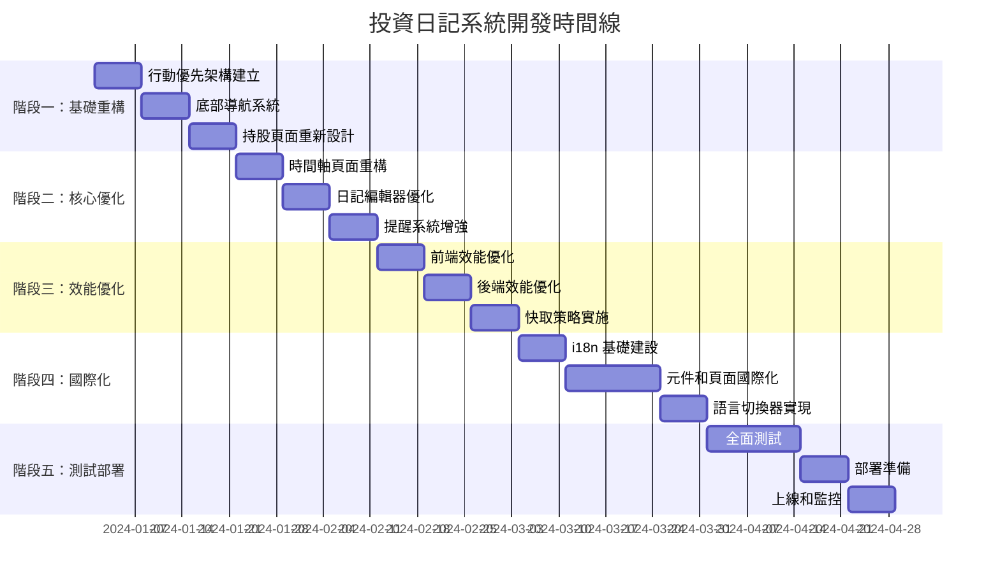
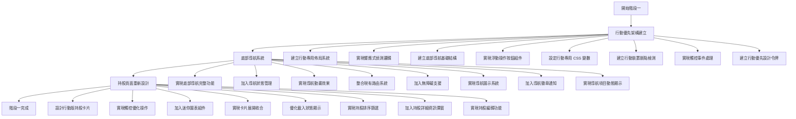
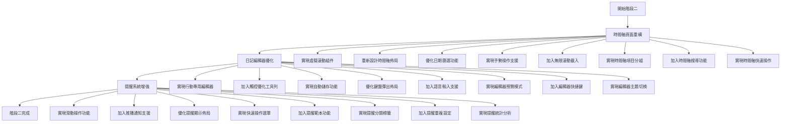
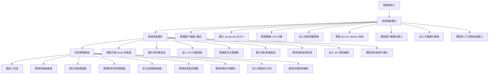
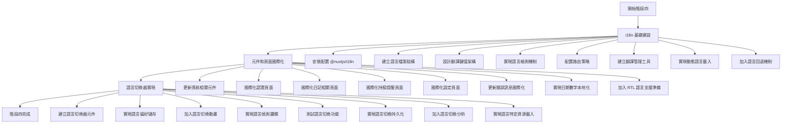
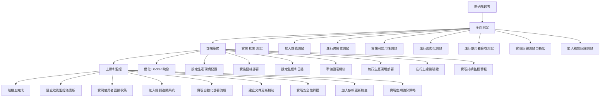
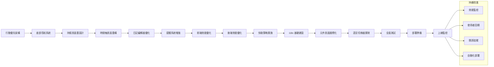
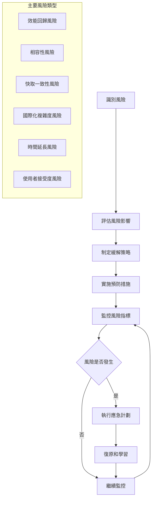
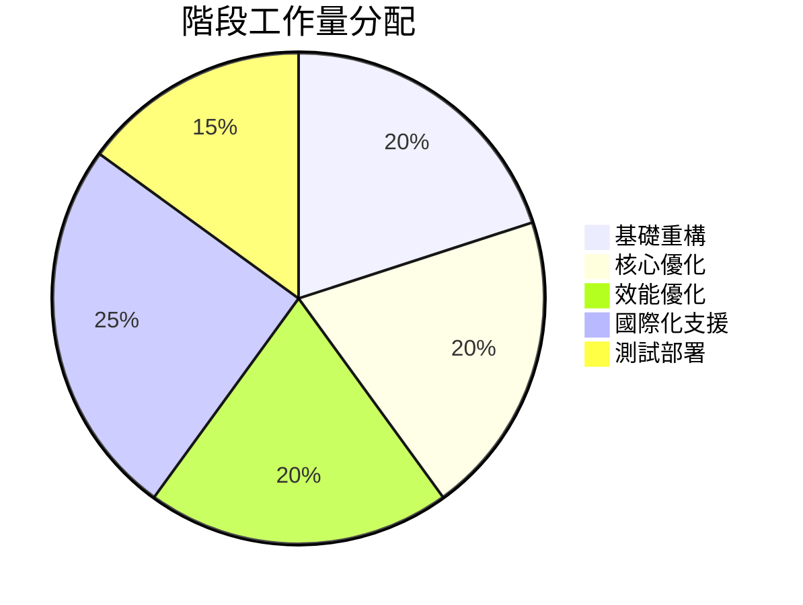
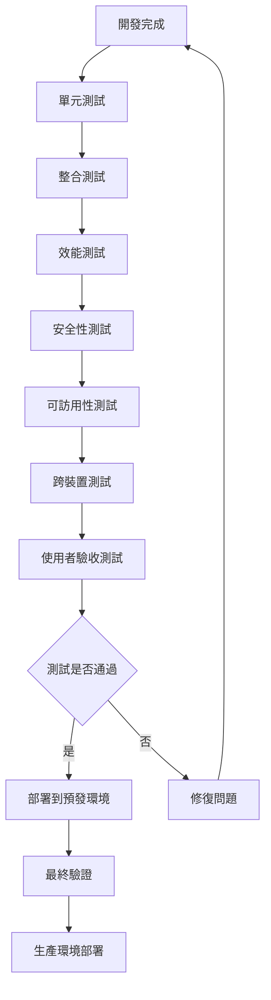

# 投資日記系統實施工作流程

## 專案整體工作流程



## 階段一：基礎重構工作流程



## 階段二：核心優化工作流程



## 階段三：效能優化工作流程



## 階段四：國際化支援工作流程



## 階段五：測試和部署工作流程



## 關鍵依賴關係圖



## 風險評估和緩解策略流程



## 資源分配和時間管理



## 技術棧依賴關係

```mermaid
flowchart TD
    A[Nuxt 3] --> B[Vue 3]
    A --> C[TypeScript]
    A --> D[Tailwind CSS]
    
    E[Prisma ORM] --> F[MySQL]
    G[Redis] --> H[快取層]
    
    I[@nuxtjs/i18n] --> J[國際化]
    K[Service Worker] --> L[PWA]
    
    M[Playwright] --> N[E2E 測試]
    O[Lighthouse CI] --> P[效能測試]
    
    Q[Docker] --> R[容器化部署]
    S[Nginx] --> T[反向代理]
```

## 品質保證流程



---

*此工作流程圖將根據實際開發進度和回饋持續更新和優化*