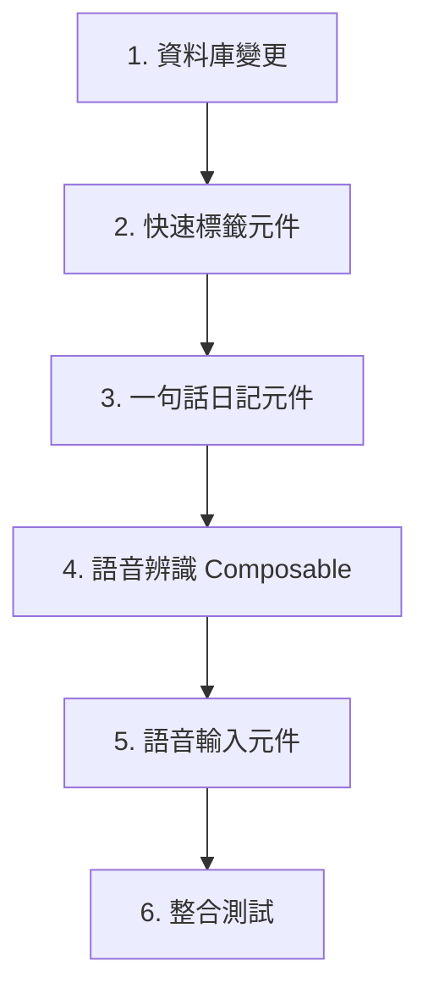

# 行動端快速日記體驗優化計劃

> 建立日期：2026-02-24
> 狀態：規劃中

---

## 📋 目標

優化行動端日記輸入體驗，降低用戶記錄門檻，提升使用頻率。

核心定位：**快速 → 簡單 → 無摩擦**

---

## 🎯 功能範圍

### Phase 1：MVP 版本

| 功能 | 描述 | 優先級 |
|------|------|--------|
| **快速標籤** | 預設標籤一鍵加入 | P0 |
| **一句話日記** | 單一輸入框快速記錄 | P0 |
| **語音轉文字** | Web Speech API 語音輸入 | P1 |

### Phase 2：進階功能（未來）

| 功能 | 描述 | 優先級 |
|------|------|--------|
| 離線建立 | IndexedDB 暫存，網路恢復後同步 | P2 |
| 定時提醒 | 每日固定時間推播提醒 | P2 |
| 自訂模板 | 用戶可建立個人常用模板 | P3 |

---

## 📐 技術設計

### 1. 快速標籤

#### 資料庫變更

```prisma
// prisma/schema.prisma

model Diary {
  // ... 現有欄位
  tagsString  String? @map("tags") @db.VarChar(500)// 逗號分隔的標籤
}

model User {
  // ... 現有欄位
  favoriteTagsString String? @map("favorite_tags") @db.VarChar(500)// 用戶最愛標籤
}
```

#### 預設標籤定義

```typescript
// types/diary.ts

export const DEFAULT_TAGS = [
  { key: 'profit', labelKey: 'tags.profit', color: 'green' },
  { key: 'loss', labelKey: 'tags.loss', color: 'red' },
  { key: 'watch', labelKey: 'tags.watch', color: 'blue' },
  { key: 'hold', labelKey: 'tags.hold', color: 'gray' },
  { key: 'learning', labelKey: 'tags.learning', color: 'purple' },
  { key: 'mistake', labelKey: 'tags.mistake', color: 'orange' },
] as const

export type TagKey = typeof DEFAULT_TAGS[number]['key']
```

#### 新增元件

```
components/
├── QuickTags.vue          # 快速標籤選擇元件
```

#### API 端點

```
GET  /api/user/tags        # 取得用戶最愛標籤
POST /api/user/tags        # 新增最愛標籤
DELETE /api/user/tags/:tag # 移除最愛標籤
```

---

### 2. 一句話日記

#### UI 設計

```
┌─────────────────────────────────────┐
│ ✕ 快速日記                    │
├─────────────────────────────────────┤
│                                     │
│ ┌─────────────────────────────────┐ │
│ │ 今天加碼台積電，看好 AI 需求... │ │ │
│ ││ │
│ └─────────────────────────────────┘ │
│                                     │
│ 🏷️ 快速標籤                         │
│ [#盈利] [#虧損] [#觀察] [+新增]      │
│                                     │
│ 📅 2026/02/24                       │
│                                     │
│ ┌─────────────────────────────────┐ │
│ │ 🎤 語音輸入           │ 📷      │ │
│ └─────────────────────────────────┘ │
│                                     │
│        [儲存日記]                    │
└─────────────────────────────────────┘
```

#### 新增元件

```
components/
├── QuickDiaryOneLiner.vue # 一句話日記主元件
```

#### 與現有元件整合

修改 [`FloatingActionButton.vue`](../components/FloatingActionButton.vue)：
- 長按 FAB → 直接開啟一句話日記
- 點擊 FAB → 展開選單（現有行為）

---

### 3. 語音轉文字

#### 技術架構

```
用戶瀏覽器                    Google API                  您的 Server
    │                            │                            │
    │ 🎤 麥克風輸入               │                            │
    │ ─────────────────────────→ │                            │
    │                            │ 語音辨識                    │
    │ ←───────────────────────── │                            │
    │ 轉成文字                    │                            │
    │                            │                            │
    │ POST /api/diaries ─────────────────────────────────────→│
    │ { content: "文字..." }     │                            │ 儲存文字
```

#### 特點

- ✅ 對 Server **零額外負擔**
- ✅ 免費使用 Google Web Speech API
- ✅ 即時轉錄顯示
- ✅ 支援繁體中文（zh-TW）

#### 瀏覽器支援

| 種類 | 支援情況 |
|------|----------|
| Chrome Desktop | ✅ 完整支援 |
| Chrome Android | ✅ 完整支援 |
| Safari iOS | ⚠️ 部分支援 |
| Safari Desktop | ⚠️ 部分支援 |
| Firefox | ❌ 不支援 |

#### 新增 Composable

```
composables/
├── useSpeechRecognition.ts # 語音辨識 composable
```

#### 新增元件

```
components/
├── VoiceInput.vue          # 語音輸入按鈕元件
```

---

## 📁 檔案結構

```
新增檔案：
├── components/
│   ├── QuickDiaryOneLiner.vue    # 一句話日記
│   ├── QuickTags.vue             # 快速標籤
│   └── VoiceInput.vue            # 語音輸入
├── composables/
│   └── useSpeechRecognition.ts   # 語音辨識
├── types/
│   └── diary.ts                  # 標籤類型定義
├── server/api/user/
│   └── tags.ts                   # 標籤 API

修改檔案：
├── prisma/schema.prisma          # 新增 tags 欄位
├── components/FloatingActionButton.vue # 整合一句話日記
├── i18n/locales/zh-TW.json       # 新增文案
├── i18n/locales/en.json          # 新增文案
├── i18n/locales/zh-CN.json       # 新增文案
```

---

## 🔄 實現順序



### 詳細步驟

#### Step 1：資料庫變更
- [ ] 修改 `prisma/schema.prisma` 新增 tags 欄位
- [ ] 執行 `npx prisma migrate dev`
- [ ] 更新 Prisma Client

#### Step 2：快速標籤
- [ ] 建立 `types/diary.ts` 定義標籤類型
- [ ] 建立 `components/QuickTags.vue`
- [ ] 新增 i18n 文案
- [ ] 建立 `/api/user/tags` API

#### Step 3：一句話日記
- [ ] 建立 `components/QuickDiaryOneLiner.vue`
- [ ] 整合 QuickTags 元件
- [ ] 修改 FloatingActionButton 支援長按

#### Step 4：語音辨識
- [ ] 建立 `composables/useSpeechRecognition.ts`
- [ ] 建立 `components/VoiceInput.vue`
- [ ] 整合到一句話日記

#### Step 5：測試與優化
- [ ] 單元測試
- [ ] E2E 測試
- [ ] 行動端實機測試
- [ ] 瀏覽器相容性測試

---

## 🌐 i18n 文案

### zh-TW.json

```json
{
  "quickDiary": {
    "oneLiner": {
      "title": "快速日記",
      "placeholder": "一句話記錄今日交易心得...",
      "save": "儲存日記",
      "saving": "儲存中...",
      "success": "日記已儲存"
    },
    "voice": {
      "start": "開始錄音",
      "stop": "停止錄音",
      "listening": "正在聆聽...",
      "notSupported": "您的瀏覽器不支援語音輸入",
      "permissionDenied": "請允許麥克風權限"
    }
  },
  "tags": {
    "profit": "盈利",
    "loss": "虧損",
    "watch": "觀察",
    "hold": "持有",
    "learning": "學習",
    "mistake": "犯錯",
    "add": "新增標籤",
    "favorite": "我的最愛",
    "addToFavorite": "加入最愛",
    "removeFromFavorite": "移除最愛"
  }
}
```

---

## ⚠️ 注意事項

### 語音輸入限制

1. **網路依賴**：部分瀏覽器需要連線到 Google 服務
2. **權限請求**：需要用戶授權麥克風權限
3. **隱私說明**：需說明語音僅在本地處理

### 瀏覽器相容性

```typescript
// 建議的 fallback 策略
if (!isSpeechSupported()) {
  // 隱藏語音按鈕
  // 或顯示提示：「您的瀏覽器不支援語音輸入」
}
```

---

## 📊 預期成果

| 指標 | 現狀 | 目標 |
|------|------|------|
| 日記建立步驟 | 2-3 步 | 1 步 |
| 輸入時間 | ~2 分鐘 | ~30 秒 |
| 行動端使用率 | 低 | 提升 50% |

---

## 📅里程碑

| 階段 | 功能 | 狀態 |
|------|------|------|
| Phase 1.1 | 快速標籤 | 📋 待開發 |
| Phase 1.2 | 一句話日記 | 📋 待開發 |
| Phase 1.3 | 語音轉文字 | 📋 待開發 |
| Phase 2 | 離線/提醒 | 🔮 規劃中 |
