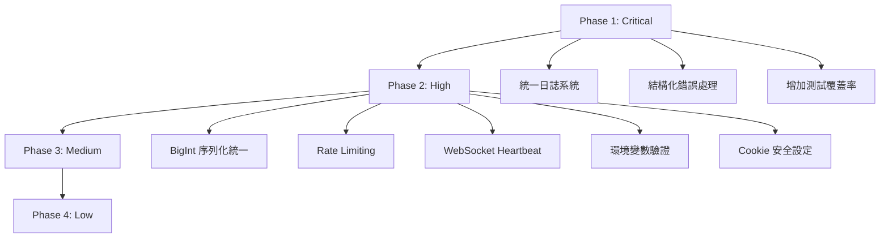

# 🔍 Production Readiness Audit Report

> 分析日期：2026-02-23
> 專案：diary-vue (Nuxt 3+ Prisma + MySQL)

---

## 📊 總覽

本報告識別出系統中低於 production level 的程式碼區域，依據嚴重程度分類：

| 等級 | 說明 | 數量 |
|------|------|------|
| 🔴 Critical | 必須修復才能上線 | 3 |
| 🟠 High | 應該在上线前修復 | 5 |
| 🟡 Medium | 建議改進，影響維護性 | 6 |
| 🟢 Low | 可作為技術債務累積 | 4 |

---

## 🔴 Critical Issues（必須修復）

### 1. 日誌系統不一致

**問題描述**：
- 專案有 [`lib/logger.ts`](../lib/logger.ts) 提供結構化日誌功能
- 但絕大多數 API 仍使用 `console.log/error/warn`
- Production 環境無法統一管理日誌級別

**證據**：
```typescript
// server/api/diaries.get.ts - 使用 console.log
console.log('[Diaries] Fetching diaries with pagination...')
console.error('[Diaries] Error fetching diaries:', error)

// server/websocket/connectionManager.ts - 使用 console.log
console.log(`[WS] User ${userIdStr} connected via socket ${socket.id}...`)
```

**影響**：
- 無法在 production 關閉 debug 日誌
- 日誌格式不統一，難以解析和監控
- 缺少 request ID 追蹤

**建議**：
- 全面替換 `console.*` 為 `logger.*`
- 在 logger 中加入 request ID 支援

---

### 2. 錯誤處理缺乏結構化

**問題描述**：
- 錯誤訊息格式不一致
- 缺少錯誤代碼（error code）系統
- 前端難以根據錯誤類型做對應處理

**證據**：
```typescript
// server/api/auth/login.post.ts - 只有 statusMessage
throw createError({
  statusCode: 401,
  statusMessage: 'Invalid email or password'
})

// server/api/diaries/[id].get.ts - 另一種格式
throw createError({
  statusCode: 404,
  statusMessage: 'Diary not found'
})
```

**影響**：
- 前端只能依賴字串比對判斷錯誤類型
- 無法做國際化處理
- 無法提供用戶具體的解決建議

**建議**：
- 實作結構化錯誤回應格式
- 加入 error code 系統

---

### 3. 測試覆蓋率不足

**問題描述**：
- 測試主要集中在 happy path
- 缺少邊界條件和錯誤情境測試
- 部分測試只是型別驗證，沒有實際邏輯測試

**證據**：
```typescript
// tests/composables/useToast.test.ts - 只有型別測試
it('should have correct Toast type structure', () => {
  const toast: Toast = { id: 'test-1', message: 'Test message', type: 'info' }
  expect(toast).toHaveProperty('id')
  // 沒有測試實際的 toast 功能
})
```

**現有測試統計**：
| 檔案 | 測試類型 | 覆蓋範圍 |
|------|----------|----------|
| auth.test.ts | API | 基本 CRUD |
| blog.test.ts | API | 基本 CRUD |
| diaries.test.ts | API | 部分 |
| useToast.test.ts | 型別 | 無實際邏輯 |
| jwt.test.ts | Unit | 較完整 |

**影響**：
- 重構風險高
- 難以發現 regression bugs

**建議**：
- 增加 E2E 測試
- 補充錯誤情境測試
- 設定覆蓋率門檻（建議 >70%）

---

## 🟠 High Issues（應該修復）

### 4. BigInt 序列化處理分散

**問題描述**：
- BigInt 轉 string 的邏輯散落在各 API
- 容易遺漏，導致 JSON 序列化錯誤

**證據**：
```typescript
// server/api/diaries.get.ts - 手動轉換
const safeDiaries = diaries.map((d) => ({
  ...d,
  id: d.id.toString(),
  alerts: d.alerts?.map((a) => ({ ...a, id: a.id.toString() })),
  transactions: d.transactions?.map((t) => ({ ...t, id: t.id.toString() })),
}))
```

**建議**：
- 建立 BigInt 序列化 middleware
- 或使用 server/plugins/bigint.ts 統一處理

---

### 5. 缺少 Rate Limiting

**問題描述**：
- 登入、註冊等敏感 API 沒有 rate limiting
- 容易遭受暴力破解攻擊

**影響的 API**：
- `/api/auth/login`
- `/api/auth/register`
- `/api/auth/refresh`

**建議**：
- 使用 `h3-rate-limit` 或自建 rate limiter
- 設定 IP / User 級別的限制

---

### 6. WebSocket 連線管理缺乏心跳機制

**問題描述**：
- WebSocket 連線沒有 heartbeat/ping-pong
- 無法及時檢測斷線

**證據**：
```typescript
// server/websocket/connectionManager.ts - 沒有心跳邏輯
register(userId: string, socket: TypedSocket): void {
  // 缺少 socket.on('ping') 或 setInterval ping
}
```

**建議**：
- 實作 ping/interval heartbeat
- 設定連線超時自動斷開

---

### 7. 環境變數驗證不完整

**問題描述**：
- 只在運行時檢查 JWT_SECRET
- 缺少啟動時的完整驗證

**證據**：
```typescript
// lib/jwt.ts - 運行時才檢查
function getSecret() {
  if (!process.env.JWT_SECRET) {
    throw new Error('JWT_SECRET is not defined')
  }
  // ...
}
```

**建議**：
- 使用 `@t3-oss/env-core` 或 zod 驗證環境變數
- 在應用啟動時驗證所有必要的環境變數

---

### 8. Cookie 安全設定

**問題描述**：
- `secure: process.env.NODE_ENV === 'production'` 可能在某些環境失效
- 缺少明確的 domain 設定

**證據**：
```typescript
// server/utils/auth.ts
setCookie(event, ACCESS_TOKEN_COOKIE, accessToken, {
  httpOnly: true,
  secure: process.env.NODE_ENV === 'production', // 可能不夠
  sameSite: 'strict',
  // 缺少 domain 設定
})
```

**建議**：
- 使用明確的 `NUXT_PUBLIC_URL` 判斷
- 考慮加入 `__Host-` prefix

---

## 🟡 Medium Issues（建議改進）

### 9. 類型定義分散

**問題描述**：
- 部分類型在 `types/` 目錄
- 部分類型在 Prisma schema
- 部分類型在 API 檔案內

**建議**：
- 統一在 `types/` 目錄管理
- 使用 Prisma 產生的類型作為基礎

---

### 10. API 回應格式不一致

**問題描述**：
- 有些 API 回傳 `{ ok: true, data: ... }`
- 有些直接回傳資料
- 有些回傳 `{ success: true }`

**證據**：
```typescript
// server/api/auth/login.post.ts
return { ok: true, data: { ... } }

// server/api/diaries/[id].delete.ts
return { success: true }

// server/api/diaries.get.ts
return { data: safeDiaries, pagination: { ... } }
```

**建議**：
- 統一 API 回應格式規範
- 建立 `ApiResponse<T>` 通用類型

---

### 11. 前端錯誤邊界缺失

**問題描述**：
- Vue 元件沒有統一的錯誤邊界
- 元件錯誤可能導致整頁崩潰

**建議**：
- 建立 `ErrorBoundary.vue` 元件
- 在關鍵頁面使用錯誤邊界包裹

---

### 12. 缺少 Request ID 追蹤

**問題描述**：
- 無法追蹤單一請求的完整生命週期
- Debug 時難以關聯前後端日誌

**建議**：
- 在 middleware 加入 `X-Request-ID` header
- 在所有日誌中包含 request ID

---

### 13. 資料庫查詢效能

**問題描述**：
- 部分 API 沒有使用 `select` 限制欄位
- 可能載入不必要的關聯資料

**已優化的例子**：
```typescript
// server/api/diaries.get.ts - 已使用 select
select: {
  id: true,
  title: true,
  // content 通常很大，列表頁不載入
  ...
}
```

**建議**：
- 檢查所有 API 的查詢效率
- 加入 query performance monitoring

---

### 14. 國際化錯誤訊息

**問題描述**：
- API 錯誤訊息只有英文
- 前端需要額外處理翻譯

**建議**：
- API 回傳 error code
- 前端根據 code 顯示對應語言的訊息

---

## 🟢 Low Issues（技術債務）

### 15. Legacy 程式碼標記

**問題描述**：
- 存在 `@deprecated` 標記但未移除的函數
- `auth-token` cookie 的向後相容性

**證據**：
```typescript
// server/utils/auth.ts
/**
 * @deprecated Use setAuthCookies instead
 */
export function setAuthCookie(event: H3Event, token: string) { ... }
```

**建議**：
- 設定移除時間表
- 加入 migration guide

---

### 16. TODO/FIXME 註解

**問題描述**：
- 程式碼中存在未處理的 TODO

**建議**：
- 整理所有 TODO/FIXME
- 轉換為 issue tracker 任務

---

### 17. Hard-coded 設定值

**問題描述**：
- 部分設定值寫死在程式碼中

**證據**：
```typescript
// server/plugins/alert-scheduler.ts
const CHECK_INTERVAL = 60000 // 應該可配置
const BUFFER_WINDOW = 5000
```

**建議**：
- 移至環境變數或設定檔

---

### 18. 程式碼註解品質

**問題描述**：
- 部分複雜邏輯缺少註解
- 部分註解與程式碼不同步

**建議**：
- 為關鍵業務邏輯加入 JSDoc
- 定期 review 註解準確性

---

## 📋 改進優先級建議



---

## 🎯 下一步行動

1. **立即處理**（本週）：
   - [ ] 統一使用 `lib/logger.ts`
   - [ ] 設計錯誤代碼系統

2. **短期處理**（2週內）：
   - [ ] 實作 rate limiting
   - [ ] 增加 E2E 測試

3. **中期處理**（1個月內）：
   - [ ] 統一 API 回應格式
   - [ ] 實作 request ID 追蹤

4. **長期累積**：
   - [ ] 移除 legacy 程式碼
   - [ ] 改善程式碼註解

---

> 本報告基於 2026-02-23 的程式碼狀態分析，建議定期重新審視。
