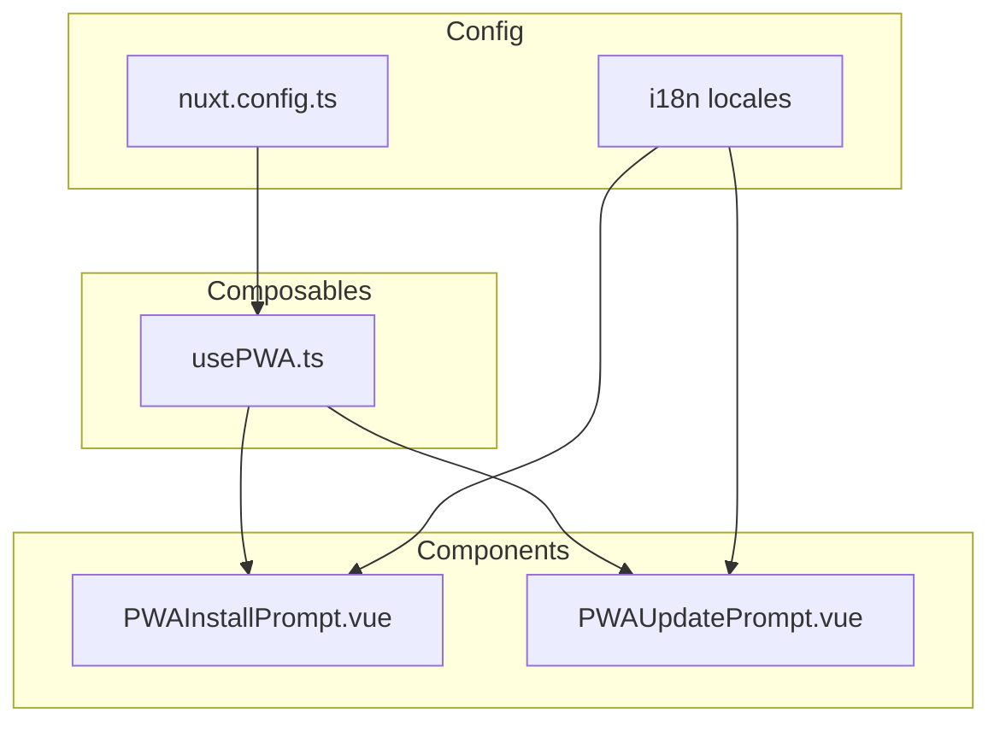

# PWA 重構計劃

## 概述

本計劃旨在重構 PWA（Progressive Web App）功能，專注於：
- 作為手機偽 app 使用
- 將 PWA 邏輯抽取到 composable
- 改善程式碼組織和可維護性
- 新增 i18n 支援

**注意**：不需要離線功能，PWA 主要作為可安裝的手機應用程式。

## 目前狀況分析

### 現有檔案結構

```
├── components/
│   ├── PWAInstallPrompt.vue    # 安裝提示元件
│   └── PWAReloadPrompt.vue     # 更新提示元件
├── nuxt.config.ts              # PWA 配置
├── public/
│   ├── icon-192x192.png
│   ├── icon-512x512.png
│   ├── icon-maskable-512x512.png
│   └── icon.svg
└── layouts/
    └── default.vue             # 使用 PWA 元件
```

### 現有問題

1. **程式碼組織問題**
   - PWA 邏輯散落在各個元件中
   - 沒有統一的狀態管理

2. **i18n 問題**
   - PWA 相關文字硬編碼在元件中

3. **快取策略**
   - 可以簡化，因為不需要離線功能

---

## 重構架構

### 新的檔案結構

```
├── composables/
│   └── usePWA.ts               # PWA 核心狀態和方法
├── components/
│   └── pwa/
│       ├── PWAInstallPrompt.vue    # 安裝提示（重構）
│       └── PWAUpdatePrompt.vue     # 更新提示（重命名+重構）
├── nuxt.config.ts              # 簡化的 PWA 配置
└── i18n/locales/
    └── *.json                  # 新增 PWA 翻譯鍵
```

### 架構圖



---

## 詳細實作計劃

### 1. 建立 usePWA Composable

**檔案**: `composables/usePWA.ts`

**功能**:
- 統一管理 PWA 安裝狀態
- 處理 beforeinstallprompt 事件
- 提供安裝方法
- 管理 Service Worker 更新狀態

**介面設計**:

```typescript
interface UsePWAReturn {
  // 安裝相關
  isInstalled: Ref<boolean>
  canInstall: Ref<boolean>
  showInstallPrompt: Ref<boolean>
  install: () => Promise<void>
  dismissInstall: () => void
  
  // 更新相關
  needRefresh: Ref<boolean>
  updateServiceWorker: () => void
  dismissUpdate: () => void
}
```

### 2. 重構 PWAInstallPrompt 元件

**檔案**: `components/pwa/PWAInstallPrompt.vue`

**改進**:
- 使用 usePWA composable
- 新增 i18n 支援
- 改善 UI/UX

### 3. 重構 PWAUpdatePrompt 元件

**檔案**: `components/pwa/PWAUpdatePrompt.vue`（原 PWAReloadPrompt.vue）

**改進**:
- 使用 usePWA composable
- 新增 i18n 支援
- 移除離線相關提示
- 改善 UI/UX

### 4. 簡化 nuxt.config.ts PWA 配置

**改進內容**:

```typescript
pwa: {
  registerType: 'autoUpdate',
  includeAssets: ['favicon.ico', 'robots.txt'],
  manifest: {
    name: '投資日記',
    short_name: '投資日記',
    description: '個人投資日記系統',
    lang: 'zh-TW',
    display: 'standalone',
    orientation: 'portrait',
    start_url: '/',
    background_color: '#ffffff',
    theme_color: '#3b82f6',
    icons: [
      // ... 保持現有配置
    ]
  },
  workbox: {
    // 簡化快取策略，只保留基本的靜態資源快取
    globPatterns: ['**/*.{js,css,html,png,svg,ico,txt}']
  },
  devOptions: {
    enabled: true,
    type: 'module'
  }
}
```

### 5. 新增 i18n 翻譯鍵

**檔案**: `i18n/locales/zh-TW.json`（以及其他語言）

**新增內容**:

```json
{
  "pwa": {
    "install": {
      "title": "安裝投資日記",
      "description": "將應用程式安裝到主畫面，獲得更好的體驗",
      "install": "安裝",
      "later": "稍後"
    },
    "update": {
      "title": "有新版本可用",
      "description": "點擊重新整理以獲取最新內容",
      "refresh": "重新整理",
      "later": "稍後"
    }
  }
}
```

---

## 實作順序

1. **第一階段：Composable**
   - 建立 `composables/usePWA.ts`

2. **第二階段：元件重構**
   - 建立 `components/pwa/` 目錄
   - 重構 `PWAInstallPrompt.vue`
   - 重構 `PWAUpdatePrompt.vue`
   - 刪除舊的 `PWAReloadPrompt.vue`

3. **第三階段：配置與i18n**
   - 簡化 `nuxt.config.ts` PWA 配置
   - 新增 i18n 翻譯鍵

4. **第四階段：整合**
   - 更新 `layouts/default.vue`
   - 測試 PWA 安裝功能

---

## 預期成果

1. **更好的程式碼組織**
   - PWA 邏輯集中在 composable
   - 元件更專注於 UI 呈現

2. **更好的用戶體驗**
   - 一致的提示樣式
   - 多語言支援

3. **更好的可維護性**
   - 統一的狀態管理
   - 可重用的邏輯
   - 清晰的檔案結構
