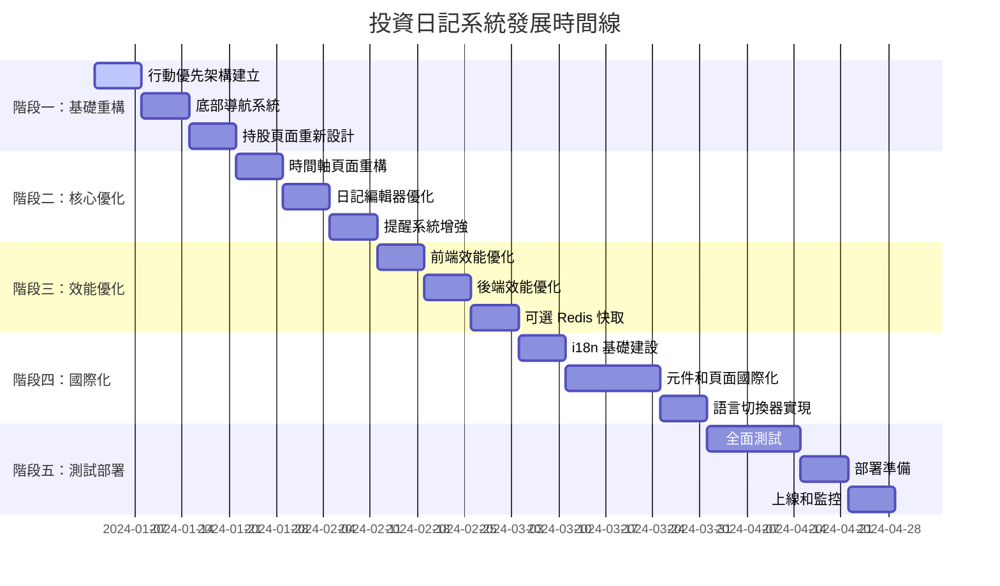

# 投資日記系統單獨實施計劃

## 📋 專案概覽

### 系統現狀
- **技術棧**: Nuxt 3 + Vue 3 + TypeScript + MySQL + Prisma ORM + Tailwind CSS
- **核心功能**: 投資日記、持股管理、提醒系統、多用戶支援、PWA
- **現有問題**: 行動裝置體驗不佳、效能有待提升、缺乏國際化支援

### 發展目標
將系統從功能完整版本優化為以行動裝置體驗為核心的高效能應用程式，同時保持現有功能的完整性。

## 📅 實施時間線

## 📝 詳細任務清單

### 階段一：基礎重構（第 1-3 週）

#### 第 1 週：行動優先架構建立

**任務 1.1-1.8：基礎架構建立**
- [ ] 建立行動專用佈局系統 (layouts/mobile.vue)
- [ ] 實現響應式偵測邏輯 (composables/useMobileDetection.ts)
- [ ] 建立底部導航基礎結構 (components/BottomNavigation.vue)
- [ ] 實現浮動操作按鈕組件 (components/FloatingActionButton.vue)
- [ ] 設定行動專用的 CSS 變數和樣式
- [ ] 建立行動裝置斷點檢測工具
- [ ] 實現觸控事件處理 composable
- [ ] 建立行動優先的設計令牌系統

**交付成果：**
- 行動優先的基礎架構
- 響應式偵測系統
- 基礎導航元件

#### 第 2 週：底部導航系統

**任務 2.1-2.8：底部導航系統**
- [ ] 實現底部導航元件完整功能
- [ ] 加入導航狀態管理 (Pinia store)
- [ ] 實現導航動畫效果 (CSS transitions)
- [ ] 整合現有路由系統
- [ ] 加入無障礙支援 (ARIA labels)
- [ ] 實現導航圖示系統
- [ ] 加入導航徽章通知功能
- [ ] 實現導航項目動態顯示/隱藏

**交付成果：**
- 完整的底部導航系統
- 導航狀態管理
- 動畫和互動效果

#### 第 3 週：持股頁面重新設計

**任務 3.1-3.8：持股頁面重新設計**
- [ ] 設計行動版持股卡片組件 (components/HoldingCard.vue)
- [ ] 實現觸控優化的操作 (長按、滑動)
- [ ] 加入迷你圖表組件 (components/MiniChart.vue)
- [ ] 實現卡片展開/收合功能
- [ ] 優化載入狀態顯示 (骨架屏)
- [ ] 實現持股排序和篩選功能
- [ ] 加入持股詳細資訊彈窗
- [ ] 實現持股編輯功能

**交付成果：**
- 行動優化的持股卡片
- 觸控友好的操作介面
- 迷你圖表組件

### 階段二：核心優化（第 4-6 週）

#### 第 4 週：時間軸頁面重構

**任務 4.1-4.8：時間軸頁面重構**
- [ ] 實現虛擬滾動組件 (components/VirtualScroller.vue)
- [ ] 重新設計時間軸佈局 (components/TimelineView.vue)
- [ ] 優化日期篩選功能 (components/DateRangePicker.vue)
- [ ] 實現手勢操作支援 (滑動、長按)
- [ ] 加入無限滾動載入
- [ ] 實現時間軸項目分組
- [ ] 加入時間軸搜尋功能
- [ ] 實現時間軸項目快速操作

**交付成果：**
- 高效能的時間軸頁面
- 虛擬滾動實現
- 手勢操作支援

#### 第 5 週：日記編輯器優化

**任務 5.1-5.8：日記編輯器優化**
- [ ] 實現行動專用的 Markdown 編輯器 (components/MobileDiaryEditor.vue)
- [ ] 加入觸控優化的工具列 (components/EditorToolbar.vue)
- [ ] 實現自動儲存功能 (debounced save)
- [ ] 優化鍵盤彈出時的佈局調整
- [ ] 加入語音輸入支援 (Web Speech API)
- [ ] 實現編輯器預覽模式
- [ ] 加入編輯器快捷鍵支援
- [ ] 實現編輯器主題切換

**交付成果：**
- 行動優化的編輯器
- 觸控友好的工具列
- 自動儲存功能

#### 第 6 週：提醒系統增強

**任務 6.1-6.8：提醒系統增強**
- [ ] 實現滑動操作功能 (components/SwipeableList.vue)
- [ ] 加入推播通知支援 (Service Worker)
- [ ] 優化提醒顯示佈局 (components/AlertCard.vue)
- [ ] 實現快速操作選單 (components/ActionMenu.vue)
- [ ] 加入提醒範本功能
- [ ] 實現提醒分類和標籤
- [ ] 加入提醒重複設定
- [ ] 實現提醒統計分析

**交付成果：**
- 滑動操作的提醒列表
- 推播通知整合
- 快速操作功能

### 階段三：效能優化（第 7-9 週）

#### 第 7 週：前端效能優化

**任務 7.1-7.8：前端效能優化**
- [ ] 實施圖片懶載入和優化 (Nuxt Image module)
- [ ] 優化 JavaScript 包大小 (code splitting)
- [ ] 實施關鍵 CSS 內聯 (critical CSS)
- [ ] 加入資源預載策略 (preload/prefetch)
- [ ] 實施 Service Worker 快取
- [ ] 實現圖片響應式載入
- [ ] 加入字體優化策略
- [ ] 實現第三方資源延遲載入

**交付成果：**
- 圖片優化系統
- 程式碼分割實現
- 快取策略實施

#### 第 8 週：後端效能優化

**任務 8.1-8.8：後端效能優化**
- [ ] 實施可選 Redis 快取層 (lib/cache/)
- [ ] 優化資料庫查詢 (Prisma 優化)
- [ ] 加入 API 回應快取
- [ ] 實施請求去重機制
- [ ] 優化資料庫連線池
- [ ] 實現查詢結果快取
- [ ] 加入 API 限流機制
- [ ] 實現資料庫索引優化

**交付成果：**
- 可選 Redis 快取系統
- 查詢優化實現
- API 效能提升

#### 第 9 週：快取策略實施

**任務 9.1-9.8：快取策略實施**
- [ ] 實現快取抽象層 (lib/cache/manager.ts)
- [ ] 建立 Redis/記憶體/無快取適配器
- [ ] 實現智慧快取管理器
- [ ] 加入快取健康檢查
- [ ] 實現快取監控端點
- [ ] 實現快取失效機制
- [ ] 加入快取統計分析
- [ ] 實現快取預熱機制

**交付成果：**
- 完整的快取系統
- 優雅降級機制
- 快取監控功能

### 階段四：國際化支援（第 10-13 週）

#### 第 10 週：i18n 基礎建設

**任務 10.1-10.8：i18n 基礎建設**
- [ ] 安裝和配置 @nuxtjs/i18n
- [ ] 建立語言檔案結構 (i18n/locales/)
- [ ] 設計翻譯鍵值架構
- [ ] 實現語言檢測機制
- [ ] 配置路由策略
- [ ] 建立翻譯管理工具
- [ ] 實現動態語言載入
- [ ] 加入語言回退機制

**交付成果：**
- i18n 基礎架構
- 語言檔案結構
- 翻譯鍵值設計

#### 第 11-12 週：元件和頁面國際化

**任務 11.1-11.8：元件和頁面國際化**
- [ ] 更新導航相關元件 (Navigation.vue, UserMenu.vue)
- [ ] 國際化認證頁面 (login.vue, register.vue)
- [ ] 國際化日記相關頁面 (diaries/*)
- [ ] 國際化持股和提醒頁面 (stocks.vue, alerts.vue)
- [ ] 國際化設定頁面 (settings.vue)
- [ ] 更新錯誤訊息國際化
- [ ] 實現日期和數字本地化
- [ ] 加入 RTL 語言支援準備

**交付成果：**
- 完全國際化的使用者介面
- 多語言錯誤訊息
- 本地化日期和數字格式

#### 第 13 週：語言切換器實現

**任務 13.1-13.8：語言切換器實現**
- [ ] 建立語言切換器元件 (components/LanguageSwitcher.vue)
- [ ] 實現語言偏好儲存
- [ ] 加入語言切換動畫
- [ ] 實現語言偵測邏輯
- [ ] 測試語言切換功能
- [ ] 實現語言切換持久化
- [ ] 加入語言切換分析
- [ ] 實現語言特定資源載入

**交付成果：**
- 語言切換器組件
- 語言偏好管理
- 完整的多語言體驗

### 階段五：測試和部署（第 14-16 週）

#### 第 14-15 週：全面測試

**任務 14.1-14.8：全面測試**
- [ ] 實施 E2E 測試 (Playwright/Cypress)
- [ ] 加入效能測試 (Lighthouse CI)
- [ ] 進行跨裝置測試 (BrowserStack)
- [ ] 實施可訪用性測試 (axe-core)
- [ ] 進行國際化測試
- [ ] 進行使用者驗收測試
- [ ] 實現回歸測試自動化
- [ ] 加入視覺回歸測試

**交付成果：**
- 完整的測試套件
- 效能測試報告
- 跨裝置相容性驗證

#### 第 16 週：部署準備和上線

**任務 16.1-16.8：部署準備和上線**
- [ ] 優化 Docker 映像 (multi-stage builds)
- [ ] 設定生產環境配置
- [ ] 實施藍綠部署
- [ ] 設定監控和日誌
- [ ] 準備回滾機制
- [ ] 執行生產環境部署
- [ ] 進行上線後驗證
- [ ] 實現持續監控和警報

**交付成果：**
- 成功的生產環境部署
- 運行中的監控系統
- 使用者回饋收集機制

## 🔧 執行檢查清單

### 每日檢查清單

#### 開發前
- [ ] 檢查分支是否正確
- [ ] 確認開發環境正常
- [ ] 查看今日任務目標
- [ ] 檢查依賴是否有更新

#### 開發中
- [ ] 遵循程式碼規範
- [ ] 編寫單元測試
- [ ] 進行本地測試
- [ ] 提交前檢查

#### 開發後
- [ ] 提交程式碼並推送到遠端
- [ ] 建立Pull Request
- [ ] 更新任務進度
- [ ] 記錄遇到的問題和解決方案

### 每週檢查清單

#### 週初
- [ ] 檢查本週任務目標
- [ ] 確認依賴和阻礙
- [ ] 安排程式碼審查
- [ ] 設定週末檢查點

#### 週中
- [ ] 檢查進度是否符合預期
- [ ] 解決遇到的技術問題
- [ ] 進行中期測試
- [ ] 調整計劃如需要

#### 週末
- [ ] 完成本週交付物
- [ ] 進行階段性測試
- [ ] 更新專案文檔
- [ ] 準備下週計劃

### 階段檢查清單

#### 階段開始
- [ ] 確認階段目標和交付物
- [ ] 檢查前置條件是否滿足
- [ ] 建立階段分支
- [ ] 設定階段監控指標

#### 階段進行中
- [ ] 每日追蹤進度
- [ ] 定期進行品質檢查
- [ ] 監控風險和問題
- [ ] 保持與團隊溝通

#### 階段結束
- [ ] 完成所有交付物
- [ ] 進行階段驗收測試
- [ ] 更新專案狀態
- [ ] 準備下一階段

## 🚨 風險管理

### 風險識別和評估

#### 高風險項目

**1. 效能回歸風險**
- **影響**：使用者體驗下降
- **機率**：中等
- **緩解**：持續效能監控、效能預算機制、自動化效能測試

**2. 相容性風險**
- **影響**：舊裝置無法使用
- **機率**：中等
- **緩解**：漸進式增強策略、廣泛裝置測試、優雅降級機制

**3. 時間延長風險**
- **影響**：專案延期
- **機率**：高
- **緩解**：彈性計劃調整、分階段實施、定期進度評估

#### 中風險項目

**1. 快取一致性風險**
- **影響**：資料不一致
- **機率**：低
- **緩解**：智慧快取策略、快取失效機制、版本化快取鍵值

**2. 國際化複雜度風險**
- **影響**：維護困難
- **機率**：中等
- **緩解**：清晰架構設計、自動化翻譯檢查、統一翻譯管理流程

### 風險緩解策略

#### 主動策略
- 建立效能預算機制
- 實施漸進式增強
- 保持彈性的計劃調整
- 建立完整的測試覆蓋

#### 被動策略
- 準備快速回滾機制
- 建立問題響應流程
- 保持溝通渠道暢通
- 準備應急資源

## 📊 成功指標

### 技術指標
- **Core Web Vitals**：FCP < 1.5s, LCP < 2.5s, FID < 100ms, CLS < 0.1
- **API 效能**：95% 的請求在 200ms 內完成
- **可用性**：99.9% 的系統可用性
- **測試覆蓋率**：80% 以上的程式碼覆蓋率

### 使用者體驗指標
- **行動裝置滿意度**：提升 40%
- **頁面載入時間**：減少 40%
- **觸控效率**：減少 50% 的誤觸操作
- **多語言支援**：100% 的介面文字國際化

### 業務指標
- **使用者留存率**：提升 25%
- **功能完成率**：提升 30%
- **錯誤率**：降低 60%
- **支援請求**：減少 40%

## 🔄 持續改進計劃

### 短期改進（上線後 1-3 個月）
- 收集使用者回饋並優化
- 監控效能指標並調整
- 修復發現的問題和 bug
- 優化關鍵使用者路徑

### 中期改進（上線後 3-6 個月）
- 基於使用數據優化功能
- 新增使用者要求的次要功能
- 擴展國際化語言支援
- 優化行動裝置特定功能

### 長期改進（上線後 6-12 個月）
- 考慮新增進階分析功能
- 評估社群功能需求
- 探索 AI 輔助功能
- 準備下一個主要版本

---

*此單獨實施計劃將根據實際執行情況和回饋持續更新和優化，確保專案成功達成所有目標*