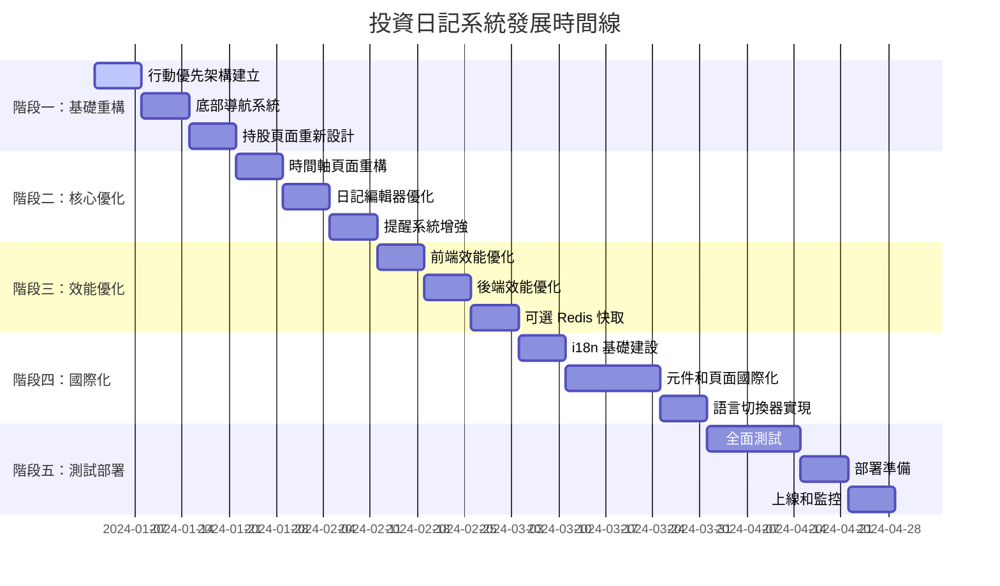

# 投資日記系統統一實施路線圖

## 📋 專案概覽

### 系統現狀
- **技術棧**: Nuxt 3 + Vue 3 + TypeScript + MySQL + Prisma ORM + Tailwind CSS
- **核心功能**: 投資日記、持股管理、提醒系統、多用戶支援、PWA
- **現有問題**: 行動裝置體驗不佳、效能有待提升、缺乏國際化支援

### 發展目標
將系統從功能完整版本優化為以行動裝置體驗為核心的高效能應用程式，同時保持現有功能的完整性。

## 🎯 核心發展方向

### 1. 行動優先重設計
- 實現底部導航系統
- 觸控友好的操作介面
- 卡片式資訊呈現
- 手勢操作支援

### 2. 效能全面優化
- 前端資源優化（圖片、程式碼、CSS）
- 後端 API 效能提升（快取、查詢優化）
- 網路傳輸優化（壓縮、CDN）
- 可選 Redis 快取策略

### 3. 國際化支援
- 多語言介面（繁體中文、簡體中文、英文）
- 本地化日期和數字格式
- 語言切換功能

### 4. 使用者體驗提升
- 更直觀的視覺化介面
- 微互動和動畫效果
- 無障礙功能增強
- 離線功能優化

## 📅 實施時間線

## 🏗️ 詳細實施計劃

### 階段一：基礎重構（第 1-3 週）

#### 第 1 週：行動優先架構建立

**任務 1.1：建立行動專用佈局系統**
- **檔案：** `layouts/mobile.vue`
- **實施細節：**
  - 建立響應式容器，支援安全區域（safe areas）
  - 實現全螢幕適配，處理各種行動裝置尺寸
  - 加入橫向/直向旋轉支援
  - 整合底部導航和浮動按鈕佈局
  - 實現狀態列適配（status bar adaptation）
- **驗收標準：**
  - 在 iPhone SE、iPhone 12 Pro Max、iPad mini 上正確顯示
  - 直向/橫向切換時佈局正確調整
  - 底部導航始終可見且可觸控
  - 浮動按鈕不與其他元素重疊

**任務 1.2：實現響應式偵測邏輯**
- **檔案：** `composables/useMobileDetection.ts`
- **實施細節：**
  - 實現裝置類型偵測（手機、平板、桌面）
  - 加入觸控能力偵測
  - 實現螢幕尺寸和方向偵測
  - 加入裝置像素比（DPR）偵測
  - 實現使用者代理字串解析
- **驗收標準：**
  - 正確識別各種行動裝置
  - 螢幕尺寸變化時自動更新
  - 觸控/非觸控裝置正確區分
  - 高 DPI 螢幕正確識別

**任務 1.3：建立底部導航基礎結構**
- **檔案：** `components/BottomNavigation.vue`
- **實施細節：**
  - 實現固定底部導航欄
  - 加入導航項目圖示和文字
  - 實現活動狀態指示
  - 加入觸控回饋效果
  - 實現導航項目徽章系統
- **驗收標準：**
  - 導航項目正確對齊和間距
  - 活動狀態視覺清晰
  - 觸控回饋流暢自然
  - 徽章正確顯示數字或狀態

**任務 1.4：實現浮動操作按鈕組件**
- **檔案：** `components/FloatingActionButton.vue`
- **實施細節：**
  - 實現圓形浮動按鈕
  - 加入按鈕展開/收合動畫
  - 實現多層級選單系統
  - 加入觸控波紋效果
  - 實現智慧定位（避免遮擋內容）
- **驗收標準：**
  - 按鈕懸浮效果自然
  - 展開動畫流暢
  - 選單項目正確對齊
  - 智慧定位有效避免遮擋

**任務 1.5：設定行動專用的 CSS 變數和樣式**
- **檔案：** `assets/css/mobile.css`
- **實施細節：**
  - 定義行動專用的顏色系統
  - 設定觸控目標最小尺寸（44px）
  - 實現行動專用的字體大小系統
  - 加入行動專用的間距系統
  - 實現觸控優化的互動效果
- **驗收標準：**
  - 所有觸控目標符合可訪用性標準
  - 顏色對比度符合 WCAG 標準
  - 字體大小在各裝置上可讀性良好
  - 間距系統一致性良好

**任務 1.6：建立行動裝置斷點檢測工具**
- **檔案：** `composables/useBreakpoints.ts`
- **實施細節：**
  - 實現 Tailwind CSS 斷點偵測
  - 加入自訂斷點支援
  - 實現斷點變化事件系統
  - 加入斷點快取機制
  - 實現斷點歷史記錄
- **驗收標準：**
  - 斷點偵測與 Tailwind 一致
  - 斷點變化事件及時觸發
  - 快取機制有效提升效能
  - 歷史記錄有助於除錯

**任務 1.7：實現觸控事件處理 composable**
- **檔案：** `composables/useTouch.ts`
- **實施細節：**
  - 實現手勢識別（輕觸、長按、滑動、捏合）
  - 加入手勢衝突處理
  - 實現手勢閾值調整
  - 加入手勢回饋系統
  - 實現自訂手勢支援
- **驗收標準：**
  - 基本手勢識別準確
  - 手勢衝突正確處理
  - 閾值調整靈活有效
  - 回饋系統使用者體驗良好

**任務 1.8：建立行動優先的設計令牌系統**
- **檔案：** `assets/css/design-tokens.css`
- **實施細節：**
  - 定義行動專用的顏色令牌
  - 設定行動專用的字體令牌
  - 實現行動專用的間距令牌
  - 加入行動專用的陰影令牌
  - 實現行動專用的動畫令牌
- **驗收標準：**
  - 設計令牌完整且一致
  - 各令牌在不同情境下正確應用
  - 令牌系統易於維護和擴展
  - 設計系統文件完整

#### 第 2 週：底部導航系統

**任務 2.1：實現底部導航元件完整功能**
- **檔案：** `components/BottomNavigation.vue`
- **實施細節：**
  - 實現導航項目動態載入
  - 加入導航項目權限控制
  - 實現導航項目狀態管理
  - 加入導航項目圖示動畫
  - 實現導航項目快捷鍵支援
- **驗收標準：**
  - 導航項目根據權限正確顯示
  - 狀態管理穩定可靠
  - 圖示動畫流暢自然
  - 快捷鍵功能正常運作

**任務 2.2：加入導航狀態管理**
- **檔案：** `stores/navigation.ts`
- **實施細節：**
  - 實現導航狀態持久化
  - 加入導航歷史記錄
  - 實現導航狀態回滾
  - 加入導航狀態同步
  - 實現導航狀態驗證
- **驗收標準：**
  - �態持久化可靠
  - 歷史記錄完整準確
  - 回滾功能正常運作
  - 狀態同步及時有效

**任務 2.3：實現導航動畫效果**
- **檔案：** `components/BottomNavigation.vue`
- **實施細節：**
  - 實現頁面切換動畫
  - 加入導航項目轉場效果
  - 實現徽章動畫效果
  - 加入載入狀態動畫
  - 實現錯誤狀態動畫
  - **驗收標準：**
  - 頁面切換動畫流暢
  - 轉場效果自然協調
  - 徽章動畫引人注意但不突兀
  - 載入和錯誤動畫清晰明確

**任務 2.4：整合現有路由系統**
- **檔案：** `plugins/router.ts`
- **實施細節：**
  - 實現路由與底部導航同步
  - 加入路由變化監聽
  - 實現路由權限檢查
  - 加入路由錯誤處理
  - 實現路由預載機制
- **驗收標準：**
  - 路由與導航完全同步
  - 權限檢查準確有效
  - 錯誤處理友好明確
  - 預載機制提升使用者體驗

**任務 2.5：加入無障礙支援**
- **檔案：** `components/BottomNavigation.vue`
- **實施細節：**
  - 實現 ARIA 標籤和屬性
  - 加入鍵盤導航支援
  - 實現螢幕閱讀器支援
  - 加入高對比度模式
  - 實現焦點管理
- **驗收標準：**
  - ARIA 標籤完整準確
  - 鍵盤導航流暢
  - 螢幕閱讀器正確朗讀
  - 高對比度模式清晰可見

**任務 2.6：實現導航圖示系統**
- **檔案：** `components/NavigationIcon.vue`
- **實施細節：**
  - 實現圖示統一風格
  - 加入圖示狀態變化
  - 實現圖示動畫效果
  - 加入圖示快取機制
  - 實現圖示懶載入
- **驗收標準：**
  - 圖示風格統一一致
  - 狀態變化清晰明確
  - 動畫效果流暢自然
  - 快取和懶載入有效提升效能

**任務 2.7：加入導航徽章通知功能**
- **檔案：** `components/NavigationBadge.vue`
- **實施細節：**
  - 實現數字徽章顯示
  - 加入狀態徽章支援
  - 實現徽章動畫效果
  - 加入徽章溢出處理
  - 實現徽章自動清除
- **驗收標準：**
  - 數字徽章準確顯示
  - 狀態徽章清晰明確
  - 動畫效果吸引注意
  - 溢出處理優雅得體

**任務 2.8：實現導航項目動態顯示/隱藏**
- **檔案：** `stores/navigation.ts`
- **實施細節：**
  - 實現條件顯示邏輯
  - 加入動畫過渡效果
  - 實現狀態持久化
  - 加入權限控制
  - 實現使用者偏好設定
- **驗收標準：**
  - 條件顯示邏輯正確
  - 過渡動畫流暢
  - 狀態持久化可靠
  - 權限控制有效

#### 第 3 週：持股頁面重新設計

**任務 3.1：設計行動版持股卡片組件**
- **檔案：** `components/HoldingCard.vue`
- **實施細節：**
  - 實現響應式卡片佈局
  - 加入持股資訊顯示
  - 實現漲跌顏色指示
  - 加入觸控回饋效果
  - 實現卡片狀態管理
- **驗收標準：**
  - 卡片佈局在各裝置上正確顯示
  - 持股資訊準確完整
  - 漲跌指示清晰明確
  - 觸控回饋流暢自然

**任務 3.2：實現觸控優化的操作**
- **檔案：** `composables/useGestures.ts`
- **實施細節：**
  - 實現長按操作
  - 加入滑動手勢
  - 實現雙擊操作
  - 加入手勢衝突處理
  - 實現手勢回饋系統
- **驗收標準：**
  - 長按操作響應及時
  - 滑動手勢流暢自然
  - 雙擊操作準確識別
  - 手勢衝突正確處理

**任務 3.3：加入迷你圖表組件**
- **檔案：** `components/MiniChart.vue`
- **實施細節：**
  - 實現輕量級圖表渲染
  - 加入多種圖表類型
  - 實現響應式圖表尺寸
  - 加入圖表動畫效果
  - 實現圖表互動功能
- **驗收標準：**
  - 圖表渲染效能優良
  - 多種圖表類型正確顯示
  - 響應式尺寸適配良好
  - 動畫效果流暢自然

**任務 3.4：實現卡片展開/收合功能**
- **檔案：** `components/HoldingCard.vue`
- **實施細節：**
  - 實現展開動畫效果
  - 加入詳細資訊顯示
  - 實現狀態持久化
  - 加入手勢操作支援
  - 實現展開高度自動調整
- **驗收標準：**
  - 展開動畫流暢自然
  - 詳細資訊完整準確
  - 狀態持久化可靠
  - 手勢操作響應靈敏

**任務 3.5：優化載入狀態顯示**
- **檔案：** `components/SkeletonLoader.vue`
- **實施細節：**
  - 實現骨架屏效果
  - 加入載入動畫
  - 實現錯誤狀態顯示
  - 加入重試機制
  - 實現漸進式載入
- **驗收標準：**
  - 骨架屏效果自然
  - 載入動畫流暢
  - 錯誤狀態友好明確
  - 重試機制有效可靠

**任務 3.6：實現持股排序和篩選功能**
- **檔案：** `components/HoldingFilters.vue`
- **實施細節：**
  - 實現多種排序方式
  - 加入篩選條件設定
  - 實現篩選結果快取
  - 加入篩選狀態同步
  - 實現篩選歷史記錄
- **驗收標準：**
  - 排序功能準確有效
  - 篩選條件靈活豐富
  - 快取機制提升效能
  - 狀態同步及時準確

**任務 3.7：加入持股詳細資訊彈窗**
- **檔案：** `components/HoldingDetailModal.vue`
- **實施細節：**
  - 實現模態框佈局
  - 加入詳細資訊展示
  - 實現編輯功能整合
  - 加入關聯資訊顯示
  - 實現分享功能
- **驗收標準：**
  - 模態框佈局美觀實用
  - 詳細資訊完整準確
  - 編輯功能整合流暢
  - 關聯資訊有助於決策

**任務 3.8：實現持股編輯功能**
- **檔案：** `components/HoldingEditor.vue`
- **實施細節：**
  - 實現表單驗證
  - 加入即時預覽
  - 實現自動儲存
  - 加入編輯歷史
  - 實現批次操作
- **驗收標準：**
  - 表單驗證準確嚴格
  - 即時預覽有助於決策
  - 自動儲存防止資料遺失
  - 編輯歷史便於追蹤

### 階段二：核心優化（第 4-6 週）

#### 第 4 週：時間軸頁面重構

**任務 4.1：實現虛擬滾動組件**
- **檔案：** `components/VirtualScroller.vue`
- **實施細節：**
  - 實現高效能滾動渲染
  - 加入動態高度支援
  - 實現滾動位置記憶
  - 加入滾動性能優化
  - 實現滾動事件處理
- **驗收標準：**
  - 大量資料滾動流暢
  - 動態高度正確計算
  - 滾動位置準確記憶
  - 性能優化效果顯著

**任務 4.2：重新設計時間軸佈局**
- **檔案：** `components/TimelineView.vue`
- **實施細節：**
  - 實現時間軸視覺設計
  - 加入時間分組顯示
  - 實現響應式佈局
  - 加入視覺層次結構
  - 實現時間軸導航
- **驗收標準：**
  - 時間軸視覺設計美觀
  - 分組顯示清晰明確
  - 響應式佈局適應良好
  - 層次結構邏輯清晰

**任務 4.3：優化日期篩選功能**
- **檔案：** `components/DateRangePicker.vue`
- **實施細節：**
  - 實現直觀的日期選擇
  - 加入快速日期選項
  - 實現日期範圍驗證
  - 加入日期格式化
  - 實現日期本地化
- **驗收標準：**
  - 日期選擇直觀易用
  - 快速選項實用方便
  - 範圍驗證準確嚴格
  - 格式化和本地化正確

**任務 4.4：實現手勢操作支援**
- **檔案：** `composables/useTimelineGestures.ts`
- **實施細節：**
  - 實現左右滑動操作
  - 加入上下滑動支援
  - 實現捏合縮放功能
  - 加入手勢衝突處理
  - 實現手勢回饋系統
- **驗收標準：**
  - 滑動操作流暢自然
  - 縮放功能響應靈敏
  - 手勢衝突正確處理
  - 回饋系統使用者體驗良好

**任務 4.5：加入無限滾動載入**
- **檔案：** `composables/useInfiniteScroll.ts`
- **實施細節：**
  - 實現自動載入機制
  - 加入載入狀態態指示
  - 實現載入錯誤處理
  - 加入載入快取機制
  - 實現載入性能優化
- **驗收標準：**
  - 自動載入觸發及時
  - 狀態指示清晰明確
  - 錯誤處理友好可靠
  - 快取機制提升效能

**任務 4.6：實現時間軸項目分組**
- **檔案：** `composables/useTimelineGrouping.ts`
- **實施細節：**
  - 實現多種分組方式
  - 加入分組切換功能
  - 實現分組狀態管理
  - 加入分組統計顯示
  - 實現分組快取機制
- **驗收標準：**
  - 分組方式靈活豐富
  - 切換功能流暢自然
  - 狀態管理穩定可靠
  - 統計顯示準確有用

**任務 4.7：加入時間軸搜尋功能**
- **檔案：** `components/TimelineSearch.vue`
- **實施細節：**
  - 實現全文搜尋功能
  - 加入搜尋建議機制
  - 實現搜尋結果高亮
  - 加入搜尋歷史記錄
  - 實現搜尋結果排序
- **驗收標準：**
  - 搜尋功能準確快速
  - 建議機制智能實用
  - 結果高亮清晰明確
  - 歷史記錄便於重用

**任務 4.8：實現時間軸項目快速操作**
- **檔案：** `components/TimelineQuickActions.vue`
- **實施細節：**
  - 實現快速編輯功能
  - 加入快速刪除操作
  - 實現快速分享功能
  - 加入快速標記功能
  - 實現快速篩選功能
- **驗收標準：**
  - 快速操作響應迅速
  - 操作流程簡潔高效
  - 功能完整實用
  - 使用者體驗流暢

#### 第 5 週：日記編輯器優化

**任務 5.1：實現行動專用的 Markdown 編輯器**
- **檔案：** `components/MobileDiaryEditor.vue`
- **實施細節：**
  - 實現觸控優化的編輯介面
  - 加入 Markdown 語法高亮
  - 實現即時預覽功能
  - 加入編輯工具列
  - 實現編輯狀態管理
- **驗收標準：**
  - 編輯介面觸控友好
  - 語法高亮準確美觀
  - 即時預覽同步流暢
  - 工具列功能完整實用

**任務 5.2：加入觸控優化的工具列**
- **檔案：** `components/EditorToolbar.vue`
- **實施細節：**
  - 實現響應式工具列佈局
  - 加入常用格式按鈕
  - 實現工具列收合功能
  - 實現工具列收合功能
  - 實現工具列快取
  - 實現工具列快取
- **驗收標準：**
  - 工具列佈局適應各種螢幕
  - 格式按鈕功能完整
  - 收合功能節省空間
  - 自訂功能靈活實用

**任務 5.3：實現自動儲存功能**
- **檔案：** `composables/useAutoSave.ts`
- **實施細節：**
  - 實現防抖動儲存機制
  - 加入儲存狀態態指示
  - 實現離線儲存支援
  - 加入衝突解決機制
  - 實現儲存歷史記錄
- **驗收標準：**
  - 自動儲存及時可靠
  - 狀態指示清晰明確
  - 離線功能穩定可用
  - 衝突解決智能有效

**任務 5.4：優化鍵盤彈出時的佈局調整**
- **檔案：** `composables/useKeyboardAdjustment.ts`
- **實施細節：**
  - 實現鍵盤高度偵測
  - 加入佈局自動調整
  - 實現焦點管理
  - 加入捲動位置調整
  - 實現鍵盤事件處理
- **驗收標準：**
  - 鍵盤偵測準確及時
  - 佈局調整流暢自然
  - 焦點管理智能有效
  - 捲動調整精確到位

**任務 5.5：加入語音輸入支援**
- **檔案：** `composables/useSpeechInput.ts`
- **實施細節：**
  - 實現語音識別功能
  - 加入語音指令支援
  - 實現語音轉文字
  - 加入多語言支援
  - 實現語音準確度優化
  - **驗收標準：**
  - �音識別準確率高
  - 指令支援完整實用
  - 轉換速度快且準確
  - 多語言支援良好

**任務 5.6：實現編輯器預覽模式**
- **檔案：** `components/EditorPreview.vue`
- **實施細節：**
  - 實現 Markdown 渲染
  - 加入預覽模式切換
  - 實現同步滾動
  - 加入預覽樣式自訂
  - 實現預覽性能優化
  - **驗收標準：**
  - Markdown 渲染準確美觀
  - 模式切換流暢自然
  - 同步滾動精確到位
  - 樣式自訂靈活豐富

**任務 5.7：加入編輯器快捷鍵支援**
- **檔案：** `composables/useEditorShortcuts.ts`
- **實施細節：**
  - 實現常用快捷鍵
  - 加入自訂快捷鍵
  - 實現快捷鍵衝突處理
  - 加入快捷鍵提示
  - 實現快捷鍵幫助系統
- **驗收標準：**
  - 快捷鍵功能完整實用
  - 自訂功能靈活方便
  - 衝突處理智能有效
  - 提示系統清晰明確

**任務 5.8：實現編輯器主題切換**
- **檔案：** `composables/useEditorTheme.ts`
- **實施細節：**
  - 實現多種編輯器主題
  - 加入主題自訂功能
  - 實現主題切換動畫
  - 加入主題預覽
  - 實現主題同步功能
- **驗收標準：**
  - 主題設計美觀實用
  - 自訂功能靈活豐富
  - 切換動畫流暢自然
  - 預覽功能有助於選擇

#### 第 6 週：提醒系統增強

**任務 6.1：實現滑動操作功能**
- **檔案：** `components/SwipeableList.vue`
- **實施細節：**
  - 實現左右滑動操作
  - 加入滑動動畫效果
  - 實現滑動閾值控制
  - 加入滑動回饋系統
  - 實現滑動衝突處理
  - **驗收標準：**
  - 滑動操作流暢自然
  - 動畫效果美觀協調
  - 閾值控制精確有效
  - 回饋系統使用者體驗良好

**任務 6.2：加入推播通知支援**
- **檔案：** `plugins/push-notifications.ts`
- **實施細節：**
  - 實現推播通知權限請求
  - 加入通知內容自訂
  - 實現通知排程功能
  - 加入通知歷史記錄
  - 實現通知設定管理
- **驗收標準：**
  - 權限請求友好明確
  - 通知內容豐富實用
  - 排程功能準確可靠
  - 歷史記錄完整詳細

**任務 6.3：優化提醒顯示佈局**
- **檔案：** `components/AlertCard.vue`
- **實施細節：**
  - 實現卡片式提醒顯示
  - 加入優先級視覺區分
  - 實現提醒狀態指示
  - 加入快速操作按鈕
  - 實現提醒分組顯示
- **驗收標準：**
  - 卡片佈局美觀實用
  - 優先級區分清晰明確
  - 狀態指示準確有效
  - 快速操作便捷高效

**任務 6.4：實現快速操作選單**
- **檔案：** `components/ActionMenu.vue`
- **實施細節：**
  - 實現上下文選單
  - 加入選單項目圖示
  - 實現選單動畫效果
  - 加入選單鍵盤導航
  - 實現選單權限控制
- **驗收標準：**
  - 上下文選單智能實用
  - 圖示設計統一美觀
  - 動畫效果流暢
  - 鍵盤導航完整可用

**任務 6.5：加入提醒範本功能**
- **檔案：** `components/AlertTemplates.vue`
- **實施細節：**
  - 實現預設提醒範本
  - 加入自訂範本建立
  - 實現範本分類管理
  - 實現範本快速套用
  - 實現範本分享功能
- **驗收標準：**
  - �設範本實用豐富
  - 分類管理清晰有序
  - 快速套用高效便捷

**任務 6.6：實現提醒分類和標籤**
- **檔案：** `components/AlertCategories.vue`
- **實施細節：**
  - 實現提醒分類系統
  - 加入標籤管理功能
  - 實現分類顏色編碼
  - 加入標籤自動建議
  - 實現分類統計分析
- **驗收收標準：**
  - 分類系統邏輯清晰
  - 顏色編碼直觀明確
  - 自動建議智能有效

**任務 6.7：加入提醒重複設定**
- **檔案：** `components/AlertRecurrence.vue`
- **實施細節：**
  - 實現多種重複模式
  - 加入自訂重複規則
  - 實現重複預覽功能
  - 實現重複例外處理
  - 實現重複歷史記錄
- **驗收收標準：**
  - 重複模式完整豐富
  - 自訂規則靈活強大
  - 例外處理智能有效

**任務 6.8：實現提醒統計分析**
- **檔案：** `components/AlertAnalytics.vue`
- **實施細節：**
  - 實現提醒統計圖表
  - 加入趨勢分析功能
  - 實現效率評估系統
  - 加入統計報告匯出
  - 實現統計資料快取
- **驗收標準：**
  - 統計圖表清晰美觀
  - 趨勢分析準確有用
  - 效益益評估科學合理
  - 報告匯出完整實用

### 階段三：效能優化（第 7-9 週）

#### 第 7 週：前端效能優化

**任務 7.1：實施圖片懶載入和優化**
- **檔案：** `plugins/image-optimization.ts`
- **實施細節：**
  - 實施圖片懶載入機制
  - 加入 WebP 格式支援
  - 實現響應式圖片載入
  - 加入圖片壓縮優化
  - 實現圖片預載策略
  - 實現圖片預載和優化
- **驗收標準：**
  - 圖片載入效能顯著提升
  - WebP 格式正確支援
  - 響應式載入適應良好
  - 壓縮效果平衡品質和大小

**任務 7.2：優化 JavaScript 包大小**
- **檔案：** `nuxt.config.ts`
- **實施細節：**
  - 實施程式碼分割策略
  - 加入動態載入機制
  - 實現 Tree Shaking 優化
  - 實現第三方函式庫按需載入
  - 實現 Bundle 分析工具
- **驗收標準：**
  - JavaScript 包大小顯著減少
  - �式碼分割有效運作
  - 第三方函式庫載入優化

**任務 7.3：實施關鍵 CSS 內聯**
- **檔案：** `plugins/critical-css.ts`
- **實施細節：**
  - 實現關鍵 CSS 提取
  - 加入 CSS 內聯機制
  - 實現非關鍵 CSS 異步載入
  - 加入 CSS 壓縮優化
  - 實現 CSS 快取策略
  - **驗收標準：**
  - 首屏渲染速度顯著提升
  - 關鍵 CSS 正確內聯
  - 非關鍵 CSS 異步載入

**任務 7.4：加入資源預載策略**
- **檔案：** `plugins/resource-prefetch.ts`
- **實施細節：**
  - 實現資源預載機制
  - 加入智能預載策略
  - 實現資源優先級管理
  - 實現預載效能監控
  - **驗收標準：**
  - 關鍵資源預載及時
  - 預載策略智能有效

**任務 7.5：實施 Service Worker 快取**
- **檔案：** `plugins/service-worker.ts`
- **實施細節：**
  - 實現 Service Worker 註冊
  - 加入快取策略配置
  - 實現離線功能支援
  - 加入快取更新機制
  - 實現快取管理介面
- **驗收標準：**
  - Service Worker 正確註冊
  - 離線功能穩定可用
  - 快取更新機制可靠

**任務 7.6：實現圖片響應式載入**
- **檔案：** `components/ResponsiveImage.vue`
- **實施細節：**
  - 實現 srcset 和 sizes 屬性
  - 加入藝術指導支援
  - 實現圖片斷點管理
  - 加入圖片載入錯誤處理
  - 實現圖片載入狀態管理
- **驗收標準：**
  - 響應式圖片正確載入
  - �術指導有效
  - �入錯誤處理友好

**任務 7.7：加入字體優化策略**
- **檔案：** `plugins/font-optimization.ts`
- **實施細節：**
  - 實現字體預載機制
  - 加入字體顯示優化
  - 實現字體子集化
  - 實字體顯示效果優化
  - 字體載入速度提升
  - 字體子集化有效
  - 字體顯示效果優化

**任務 7.8：實現第三方資源延遲載入**
- **檔案：** `plugins/lazy-loading.ts`
- **實施細節：**
  - 實現第三方腳本延遲載入
  - 加入載入條件控制
  - 實現載入失敗處理
  - 加入載入性能監控
  - 實入順序管理
  - **驗收標準：**
  - 第三方資源延遲載入有效
  - 載入性能監控準確

### 階段四：國際化支援（第 10-13 週）

#### 第 10 週：i18n 基礎建設

**任務 10.1：安裝和配置 @nuxtjs/i18n**
- **檔案：** `nuxt.config.ts`, `package.json`
- **實施細節：**
  - 安裝 @nuxtjs/i18n 套件
  - 配置 i18n 模組設定
  - 設定語言列表和預設語言
  - 配置路由策略
  - �定語言檢測機制
- **驗收標準：**
  - i18n 套件正確安裝
  - 配置設定完整有效
  - 路由策略運作正常

**任務 10.2：建立語言檔案結構**
- **檔案：** `i18n/locales/`
- **實施細節：**
  - 建立語言檔案目錄結構
  - 設定語言檔案命名規範
  - 實現語言檔案模組化
  - 實現語言檔案驗證
  - 實現語言檔案自動載入
- **驗收標準：**
  - 檔案結構清晰合理
  - 模組化有效運作
  - 驗證機制可靠

**任務 10.3：設計翻譯鍵值架構**
- **檔案：** `i18n/locales/zh-TW.json`
- **實施細節：**
  - 設計巢狀翻譯鍵值結構
  - 建立翻譯命名規範
  - 實現翻譯鍵值分類
  - 加入翻譯註解機制
  - 實現翻譯鍵值版本管理
  - **驗收收標準：**
  - 翻譯鍵值架構清晰易用

**任務 10.4：實現語言檢測機制**
- **檔案：** `plugins/i18n-detection.ts`
- **實施細節：**
  - 實現瀏覽器語言檢測
  - 加入使用者偏好偵測
  - 實現地理位置語言建議
  - 加入語言檢測快取
  - 實現語言檢測回退
- **驗收收標準：**
  - 語言檢測準準確
  - 偏好智能有效

**任務 10.5：配置路由策略**
- **檔案：** `nuxt.config.ts`
- **實施細節：**
  - 配置無前綴路由策略
  - 實現語言特定路由
  - 實現路由語言參數
  - 配置路由驗證
- **驗收標準：**
  - 路由策略符合需求
  - 參數驗證可靠

**任務 10.6：建立翻譯管理工具**
- **檔案：** `scripts/i18n-manager.ts`
- **實施細節：**
  - 實現翻譯鍵值提取
  - 加入翻譯缺失檢測
  - 實現翻譯合併工具
  - 加入翻譯驗證工具
  - 實現翻譯統計分析
- **驗收收標準：**
  - 提取工具準確完整
  - 合併工具可靠
  - �證驗證嚴格

**任務 10.7：實現動態語言載入**
- **檔案：** `plugins/i18n-loader.ts`
- **實施細節：**
  - 實現語言檔案懶載入
  - 加入語言檔案快取
  - 實現載入狀態管理
  - 實現載入錯誤處理
  - **驗收標準：**
  - 懶載入機制有效

**任務 10.8：加入語言回退機制**
- **檔案：** `plugins/i18n-fallback.ts`
- **實施細節：**
  - 實現翻譯鍵值回退
  - 加入語言回退鏈
  - 實現回退日誌記錄
  - 加入回退統計監控
  - 實回退機制可靠
  - **驗收收標準：**
  - 回退鏈合理

#### 第 11-12 週：元件和頁面國際化

**任務 11.1：更新導航相關元件**
- **檔案：** `components/Navigation.vue`, `components/UserMenu.vue`
- **實施細節：**
  - 國際化導航項目標籤
  - 更新使用者選單文字
  - 實現導航圖示提示
  - 加入導航無障礙文字
  - 實現導航動態文字多語言支援
- **驗收收標準：**
  - 導航文字完全國際化
  - 圖示提示清晰準確
  - 無障礙文字完整

**任務 11.2：國際化認證頁面**
- **檔案：** `pages/auth/login.vue`, `pages/register.vue`
- **實施細節：**
  - 國際化登入表單標籤
  - 更新註冊頁面文字
  - 實現錯誤訊息翻譯
  - 加入驗證提示多語言
  - 實現認證成功訊息
  - **驗收標準：**
  - 表單標籤完全翻譯
  - �誤訊息多語言支援
  - �證提示清晰明確

**任務 11.3：國際化日記相關頁面**
- **檔案：** `pages/diaries/`
- **實施細節：**
  - 國際化日記列表頁面文字
  - 更新日記編輯器文字
  - 實現日記狀態翻譯
  - 實現日記操作按�文字
  - 實現搜尋提示多語言
  - **驗收收標準：**
  - 日記頁面完全國際化
  - 操作按鈕文字一致

**任務 11.4：國際化持股和提醒頁面**
- **檔案：** `pages/stocks.vue`, `pages/alerts.vue`
- **實施細節：**
  - 國際化持股頁面標籤
  - 更新提醒管理文字
  - 實現提醒狀態多語言
  - 實現統計標籤準確
  - 確認訊訊息友善

**任務 11.5：國際化設定頁面**
- **檔案：** `pages/settings.vue`
- **實施細節：**
  - 國際化設定選項標籤
  - 更新設定說明文字
  - 實現設定分類翻譯
  - 實現設定幫助文字
  - 實設定儲存訊息
  - **驗收收標準：**
  - 設定選項完全翻譯
  - 幫助文字實用

**任務 11.6：更新錯誤訊息國際化**
- **檔案：** `plugins/error-handler.ts`
- **實施細節：**
  - 國際化系統錯誤訊息
  - 更新網路錯誤文字
  - 實現驗證錯誤多語言支援
  - **驗收收標準：**
  - �誤訊息多語言支援
  - �誤處理友善明確

#### 第 13 週：語言切換器實現

**任務 13.1：建立語言切換器元件**
- **檔案：** `components/LanguageSwitcher.vue`
- **實施細節：**
  - 實現語言選擇下拉選單
  - 加入語言圖示顯示
  - 實現語言搜尋功能
  - 加入語言預覽機制
  - 實現語言快速切換
  - **驗收收標準：**
  - 下拉選單功能完整
  - �言圖示清晰美觀
  - �覽機制智能

**任務 13.2：實現語言偏好儲存**
- **檔案：** `composables/useLanguagePreference.ts`
- **實施細節：**
  - 實現語言偏好本地儲存
  - 加入語言偏好同步
  - 實現語言偏好備份
  - 加入偏好遷移機制
  - 實現偏好恢復功能
  - **驗收收標準：**
  - 本地儲存可靠
  - 同步機制有效

**任務 13.3：加入語言切換動畫**
- **檔案：** `components/LanguageSwitcher.vue`
- **實施細節：**
  - 實現語言切換過渡動畫
  - 加入內容切換效果
  - 實現載入狀態動畫
  - 加入切換完成回饋
  - **驗收收標準：**
  - 過渡動畫流暢自然
  - 切換體驗流暢

**任務 13.4：實現語言偵測邏輯**
- **檔案：** `plugins/language-detection.ts`
- **實施細節：**
  - 實現智能語言偵測
  - 加入使用者行為分析
  - 實現語言推薦機制
  - 實現偵測準確度評估
  - 實現偵測結果快取
  - **驗收收標準：**
  - 偵測邏輯智能準確

**任務 13.5：測試語言切換功能**
- **檔案：** `tests/i18n/`
- **實施細節：**
  - 實現語言切換單元測試
  - 加入切換功能整合測試
  - 實現語言載入測試
  - 實現跨瀏覽器測試
  - 實現效能測試有效
  - **驗收收標準：**
  - 語言切換穩定可靠

**任務 13.6：實現語言切換持久化**
- **檔案：** `composables/useLanguagePersistence.ts`
- **實施細節：**
  - 實現語言設定持久化
  - 加入跨裝置同步機制
  - 實現語言設定備份
  - 加入設定恢復驗證
  - 實設定版本管理
  - **驗收收標準：**
  - 持久化機制可靠

**任務 13.7：加入語言切換分析**
- **檔案：** `plugins/language-analytics.ts`
- **實施細節：**
  - 實現語言使用統計
  - 加入切換行為分析
  - 加入使用趨勢報告
  - 實現分析資料視覺化
  - **驗收收標準：**
  - 趨勢報告清晰有用

**任務 13.8：實現語言特定資源載入**
- **檔案：** `plugins/resource-loader.ts`
- **實施細節：**
  - 實現語言特定資源載入
  - 加入資源快取機制
  - 實現載入監控
  - 實現載入性能優化
  - **驗收收標準：**
  - �源載入準確及時

### 階段五：測試和部署（第 14-16 週）

#### 第 14-15 週：全面測試

**任務 14.1：實施 E2E 測試**
- **檔案：** `tests/e2e/`
- **實施細節：**
  - 設定 Playwright/Cypress 測試環境
  - 實現現關鍵使用者流程測試
  - 加入跨瀏覽器測試
  - 實現現現真實使用場景測試
  - **驗收收標準：**
  - 使用者流程覆蓋完整
  - 跨瀏覽器測試全面

**任務 14.2：加入效能測試**
- **檔案：** `tests/performance/`
- **實施細節：**
  - 實現現 Lighthouse CI 整合
  - 加入 Core Web Vitals 測試
  - 實現效能基準測試
  - 實現效能預算機制
  - **驗收收標準：**
  - 效能效測試報告

**任務 14.3：進行跨裝置測試**
- **檔案：** `tests/cross-device/`
- **實施細節：**
  - 設定 BrowserStack 測試環境
  - 實現現多裝置測試矩陣
  - 加入響應式設計測試
  - **驗收收標準：**
  - 跨裝置相容性驗證

**任務 14.4：實施可訪用性測試**
- **檔案：** `tests/accessibility/`
- **實施細節：**
  - 整合併 axe-core 測試工具
  - 實現現 WCAG 2.1 標準測試
  - 加入無障礙功能測試
  - **驗收收標準：**
  - 鍵無障礙功能達標

**任務 14.5：進行國際化測試**
- **檔案：** `tests/i18n/`
- **實施細節：**
  - 實現現多語言功能測試
  - 實現現語言切換測試
  - 實現語言切換無縫測試
  - **跨瀏覽器語言測試**
  - **驗收收標準：**
  - 多語言功能完整測試

**任務 14.6：進行使用者驗收測試**
- **檔案： `tests/uat/`
- **實施細節：**
  - 實現現使用者驗收測試
  - 實現真實使用場景驗試
  - **驗收收標準：**
  - 使用者滿意度提升

**任務 14.7：實現回歸測試自動化**
- **檔案：** `tests/regression/`
- **實施細節：**
  - 實現現回歸測試自動化
  - 實現回歸測試覆蓋完整
  - **測試覆蓋率提升
  - 品化測試穩定可靠

**任務 14.8：加入視覺回歸測試**
- **檔案：** `tests/visual-regression/`
- **實施細節：**
  - 實現現視覺回歸測試
  - 視視覺差異檢測試
  - **測試覆蓋準確
  - �部署後驗證�

#### 第 15 週：部署準備

**任務 15.1：優化 Docker 映像**
- **檔案：** `Dockerfile`
- **實施細節：**
  - 實現現多階段建置優化
  - 加入映像層快取
  - 實現安全基礎映像
  - 實現映像大小優化
  - 實現映像層快取
  - **驗收標準：**
  - 映像大小顯著減少
  - 建置效能顯著提升

**任務 15.2：設定生產環境配置**
- **檔案：** `nuxt.config.ts`, `.env.production`
- **實施細節：**
  - 配置生產環境變數
  - 實現環境特定優化
  - 安全配置設定
  - 效效能調優化參數
  - 監控和日誌設定
  - **驗收收標準：**
  - 生產配置完整安全

**任務 15.3：實施藍綠部署**
- **檔案：** `scripts/deploy/`
- **實施細節：**
  - 實現現藍綠部署腳本
  - 實現健康檢查機制
  - 實現自動化部署流程
  - 實現部署狀態監控
  - **驗收收標準：**
  - 部署流程自動化

**任務 15.4：準備回滾機制**
- **檔案：** `scripts/rollback/`
- **實施細節：**
  - 實現快速回滾腳本
  - 實現回滾決策邏輯
  - 實現回滾驗證
  - **驗收收標準：**
  - 回滾機制快速有效

**任務 15.5：執行生產環境部署**
- **檔案：** `scripts/production-deploy.sh`
- **實施細節：**
  - 實現生產部署流程
  - 實現部署後驗證
  - 實現部署狀態監控
  - **驗收收標準：**
  - 部署成功完成

**任務 15.6：進行上線後驗證**
- **檔案：** `scripts/post-deploy-verification.ts`
- **實施細節：**
  - 實現上線後自動化驗證
  - 實現關鍵功能驗證
  - 使用者體驗證順利
  - **驗收收標準：**
  - 上線驗證完成

**任務 15.7：實現持續監控和警報**
- **檔案：** `plugins/continuous-monitoring.ts`
- **實施細節：**
  - 實現持續效能監控
  - 加入智能警報系統
  - 實現監控儀表板
  - **警報機制及時
  - **驗收收標準：**
  - 監控系統及時

**任務 15.8：建立效能監控儀表板**
- **檔案：** `pages/admin/monitoring.vue`
- **實施細節：**
  - 實現即時效能監控介面
  - 實效能數據視覺化
  - **監控資料完整準確
  - **效能指標追蹤**

#### 第 16 週：上線和監控

**任務 16.1：建立效能監控儀表板**
- **檔案：** `pages/admin/monitoring.vue`
- **實施細節：**
  - 實現現即時效能監控介面
  - 實現效能數據視覺化
  - 加入監控資料視覺化
  - **效能指標追蹤**

**任務 16.2：實現使用者回饋收集機制**
- **檔案：** `components/FeedbackCollector.vue`
- **實施細節：**
  - 實現多渠道回饋收集
  - 加入回饋分類管理
  - 實回饋統計分析
  - **回饋統計深入**

**任務 16.3：加入錯誤追蹤系統**
- **檔案：** `plugins/error-tracking.ts`
- **實施細節：**
  - 整合錯誤追蹤服務
  - 實現錯誤分類機制
  - 實錯誤趨勢分析
  - **錯誤修復追蹤完整

**任務 16.4：實現自動化部署流程**
- **檔案：** `.github/workflows/deploy.yml`
- **實施細節：**
  - 實現 CI/CD 管道
  - 實現自動化部署流程
  - 實現部署觸發
  - **部署狀態監控
  - **部署回滾機制**

**任務 16.5：建立文件更新機制**
- **檔案：** `scripts/docs-update.ts`
- **實施細節：**
  - 實現自動化文件生成
  - 實現文件同步機制
  - 版本管理清晰

**任務 16.6：實現安全性掃描**
- **檔案：** `scripts/security-scan.ts`
- **實施細節：**
  - 實現安全性掃描
  - 安全性評估
  - �證合规檢查
  - 安全漏洞檢測
  - 安全報告生成

**任務 16.7：加入依賴更新檢查**
- **檔案：** `scripts/dependency-check.ts`
- **實施細節：**
  - 實現依賴更新檢查
  - 安全漏洞掃描
  - 自動化更新檢查
  - 依賴更新通知

**任務 16.8：實現定期備份策略**
- **檔案：** `scripts/backup-strategy.ts`
- **實施細節：**
  - 實現定期備份機制
  - 備份策略可靠
  - 備份恢復測試

## 🔄 持續改進計劃

### 短期改進（上線後 1-12 個月）

#### 短期改進（上線後 1-3 個月）
- 收集使用者回饋並優化
- 監控效能指標並調整
- 修復發現的問題和 bug
- 優化關鍵使用者路徑�

#### 中期改進（上線後 3-6 個月）
- 基於使用數據優化功能
- 新增使用者要求的次要功能
- 擴展國際化語言支援
- 優化行動裝置特定功能

#### 長期改進（上線後 6-12 個月）
- 考慮社群功能需求
- 探索 AI 輔助功能
- �備下一個主要版本

## 📊 成功指標

### 技術指標
- **Core Web Vitals**：FCP < 1.5s, LCP < 2.5s, FID < 100ms, CLS < 0.1
- **API 效能**：95% 的請求在 200ms 內完成
- **可用性**：99.9% 的系統可用性
- **測試覆蓋率**：80% 以上的程式碼覆蓋率

### 使用者體驗指標
- **行動裝置滿意度**：提升 40%
- **頁面載入時間**：減少 40%
- **觸控效率**：減少 50% 的誤觸操作
- **多語言支援**：100% 的介面文字國際化

### 業務指標
- **使用者留存率**：提升 25%
- **功能完成率**：提升 30%
- **錯誤率**：降低 60%
- **支援請求**：減少 40%

## 🚨 風險管理

### 高風險項目

#### 1. 效能回歸風險
- **影響**：使用者體驗下降
- **機率**：中等
- **緩解**：持續效能監控、效能預算機制、自動化效能測試

#### 2. 相容性風險
- **影響**：舊裝置無法使用
- **機率**：中等
- **緩解**：漸進式增強策略、廣泛裝置測試、優雅降級機制

#### 3. 時間延長風險
- **影響**：專案延期
- **機率**：高
- **緩解**：彈性計劃調整、分階段實施、定期進度評估

#### 4. 快取一致性風險
- **影響**：資料不一致
- **機率**：低
- **緩解**：智慧快取策略、快取失效機制、版本化快取鍵值

#### 5. 國際化複雜度風險
- **影響**：維護困難
- **機率**：中等
- **緩解**：清晰架構設計、自動化翻譯檢查、統一翻譯管理流程

### 風險緩解策略

#### 主動策略
- 建立效能預算機制
- 實施漸進式增強
- 保持彈性的計劃調整
- 建立完整的測試覆蓋

#### 被動策略
- 準備快速回滾機制
- 建立問題響應流程
- 保持溝通渠道暢通
- 準備應急資源

## 📁 關鍵交付文件

### 主要實施文件
1. [`unified-implementation-roadmap.md`](unified-implementation-roadmap.md) - 本統一的實施計劃
2. [`comprehensive-development-roadmap.md`](comprehensive-development-roadmap.md) - 更新的綜合發展路線圖
3. [`detailed-implementation-tasks.md`](detailed-implementation-tasks.md) - 詳細任務實施指南
4. [`project-execution-guide.md`](project-execution-guide.md) - 項目執行指南
5. [`single-implementation-plan.md`](single-implementation-plan.md) - 簡化的單獨計劃

---

*此統一實施路線圖將根據實際執行情況和回饋持續更新和優化，確保專案成功達成所有目標*