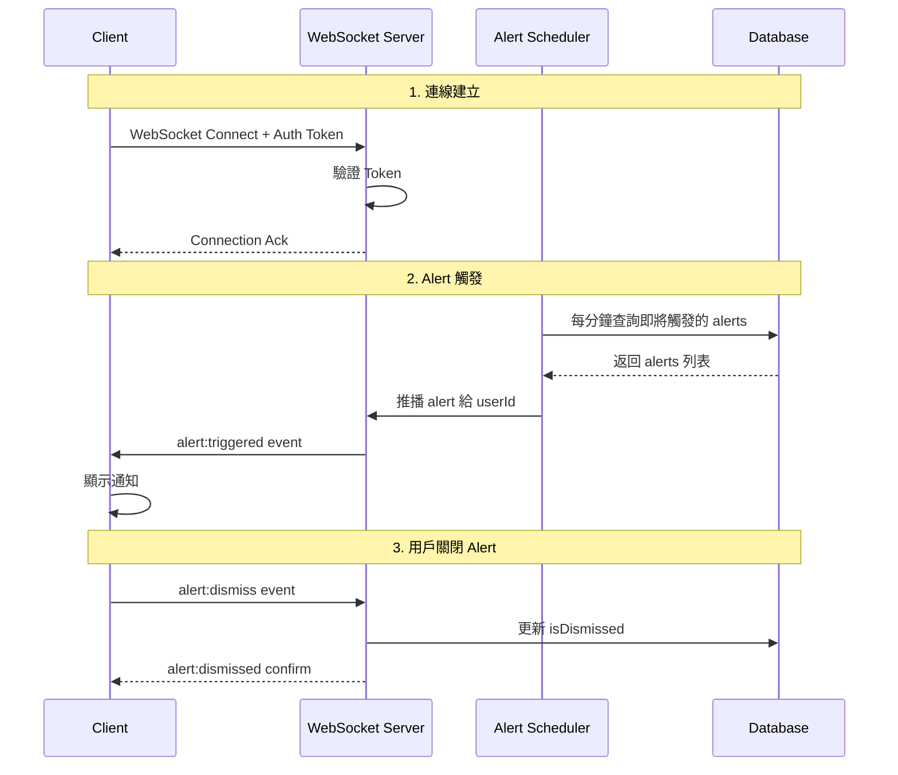

# WebSocket Alerts 推播系統導入計劃

## 📋 專案概述

將現有的 Alerts 系統從 Polling 模式改為 WebSocket 即時推播，以減少伺服器負擔並提供即時通知體驗。

## 🎯 目標

- 消除無效的 HTTP 輪詢請求（預估減少 99%）
- Alert 延遲從 30 秒降至即時
- 保持與現有系統的向下相容性
- 支援斷線重連機制

---

## 📊 現有架構分析

### 目前 Alerts 流程

```
┌─────────────┐    HTTP GET /api/alerts    ┌─────────────┐
│   Client    │ ─────────────────────────► │   Server    │
│  (Polling)  │ ◄───────────────────────── │  (REST API) │
└─────────────┘    每30秒~5分鐘            └─────────────┘
       │                                        │
       │ 1. 檢查 alertQueue                     │
       │ 2. 顯示 currentAlert                   │
       │ 3. 用戶 dismiss後呼叫 PUT API          │
       └────────────────────────────────────────┘
```

### 相關檔案

| 檔案 | 用途 |
|------|------|
| [`composables/useAlerts.ts`](composables/useAlerts.ts) | 前端 Polling 邏輯 |
| [`server/api/alerts.get.ts`](server/api/alerts.get.ts) | 取得 alerts API |
| [`server/api/alerts.post.ts`](server/api/alerts.post.ts) | 建立 alert API |
| [`server/api/alerts/[id]/dismiss.put.ts`](server/api/alerts/[id]/dismiss.put.ts) | 關閉 alert API |
| [`server/plugins/alerts-checker.ts`](server/plugins/alerts-checker.ts) | 伺服器端 cron 檢查 |
| [`prisma/schema.prisma`](prisma/schema.prisma) | Alert 資料模型 |

---

## 🏗️ 新架構設計

### 系統架構圖

```
┌──────────────────────────────────────────────────────────────────┐
│                         Client Browser                            │
├──────────────────────────────────────────────────────────────────┤
│  useAlerts.ts                                                     │
│  ┌─────────────────┐    ┌─────────────────┐                      │
│  │ WebSocket Client│◄──►│  Fallback: HTTP │                      │
│  │  - 連線管理      │    │  Polling        │                      │
│  │  - 自動重連      │    │  (斷線時備用)    │                      │
│  │  - 訊息處理      │    └─────────────────┘                      │
│  └─────────────────┘                                              │
└───────────────────────────┬──────────────────────────────────────┘
                            │ WebSocket Connection
                            ▼
┌──────────────────────────────────────────────────────────────────┐
│                         Nuxt Server                               │
├──────────────────────────────────────────────────────────────────┤
│  server/plugins/websocket.ts                                      │
│  ┌─────────────────────────────────────────────────────────────┐ │
│  │  WebSocket Server                                            │ │
│  │  ┌───────────────┐  ┌───────────────┐  ┌───────────────┐   │ │
│  │  │ Connection    │  │  Auth         │  │  Alert        │   │ │
│  │  │ Manager       │  │  Handler      │  │  Pusher       │   │ │
│  │  └───────────────┘  └───────────────┘  └───────────────┘   │ │
│  └─────────────────────────────────────────────────────────────┘ │
│                              │                                    │
│                              ▼                                    │
│  ┌─────────────────────────────────────────────────────────────┐ │
│  │  Alert Scheduler (取代 alerts-checker.ts)                    │ │
│  │  - 每分鐘檢查即將觸發的 alerts                                │ │
│  │  - 透過 WebSocket 推播給對應用戶                              │ │
│  └─────────────────────────────────────────────────────────────┘ │
└──────────────────────────────────────────────────────────────────┘
                              │
                              ▼
                    ┌─────────────────┐
                    │     MySQL       │
                    │   (Prisma)      │
                    └─────────────────┘
```

### 訊息流程



---

## 🔧 技術選型

### 選項比較

| 特性 | 原生 WebSocket | Socket.io |
|------|----------------|-----------|
| 套件大小 | 無額外套件 | ~30KB |
| 自動重連 | 需手動實作 | ✅ 內建 |
| Heartbeat | 需手動實作 | ✅ 內建 |
| Fallback | 無 | ✅ HTTP long-polling |
| Rooms/Namespaces | 需手動實作 | ✅ 內建 |
| 除錯工具 | 基本 | ✅ 完善 |
| Nuxt 整合 | 需手動 | 社群套件可用 |

### 建議：**Socket.io**

理由：
1. 內建斷線重連機制
2. 自動降級到 HTTP long-polling
3. Room 機制方便按 userId 推播
4. 成熟穩定，文件完善

### 需要安裝的套件

```bash
npm install socket.io
# 或選用 nuxt-socket-io (社群維護)
```

---

## 📁 檔案結構規劃

```
server/
├── plugins/
│   ├── websocket.ts          # WebSocket 伺服器初始化
│   └── alert-scheduler.ts    # Alert 推播排程器 (取代 alerts-checker.ts)
├── websocket/
│   ├── connectionManager.ts  # 連線管理
│   ├── authHandler.ts        # WebSocket 認證
│   └── alertHandler.ts       # Alert 訊息處理
└── api/
    └── alerts/
        └── ...               # 保留現有 REST API 作為備用

composables/
├── useAlerts.ts              # 重構：加入 WebSocket 支援
└── useWebSocket.ts           # 新增：WebSocket 連線管理

types/
└── websocket.ts              # WebSocket 訊息型別定義
```

---

## 📝 實作計劃

### Phase 1: 基礎建設

#### 1.1 安裝 Socket.io

```bash
npm install socket.io
```

#### 1.2 建立 WebSocket 伺服器

**檔案**: `server/plugins/websocket.ts`

```typescript
import { Server } from 'socket.io'
import type { NitroApp } from 'nitropack'
import { verifyAccessToken } from '~/lib/jwt'
import { connectionManager } from '../websocket/connectionManager'

export default defineNitroPlugin((nitroApp: NitroApp) => {
  const io = new Server(nitroApp.h3App.node?.server, {
    cors: {
      origin: process.env.NUXT_PUBLIC_SITE_URL || '*',
      credentials: true
    },
    path: '/socket.io/'
  })

  // 認證中間件
  io.use(async (socket, next) => {
    const token = socket.handshake.auth.token
    if (!token) {
      return next(new Error('Unauthorized'))
    }
    
    try {
      const payload = await verifyAccessToken(token)
      socket.data.userId = payload.userId
      next()
    } catch (err) {
      next(new Error('Invalid token'))
    }
  })

  io.on('connection', (socket) => {
    const userId = socket.data.userId
    connectionManager.register(userId, socket)
    
    socket.on('disconnect', () => {
      connectionManager.unregister(userId, socket.id)
    })
  })

  // 掛載到 NitroApp 供其他模組使用
  nitroApp.socketIo = io
})
```

#### 1.3 連線管理器

**檔案**: `server/websocket/connectionManager.ts`

```typescript
import type { Socket } from 'socket.io'

class ConnectionManager {
  // userId -> Socket[]
  private connections: Map<string, Set<Socket>> = new Map()

  register(userId: string, socket: Socket) {
    if (!this.connections.has(userId)) {
      this.connections.set(userId, new Set())
    }
    this.connections.get(userId)!.add(socket)
    console.log(`[WS] User ${userId} connected. Total sockets: ${this.connections.get(userId)!.size}`)
  }

  unregister(userId: string, socketId: string) {
    const userSockets = this.connections.get(userId)
    if (userSockets) {
      for (const socket of userSockets) {
        if (socket.id === socketId) {
          userSockets.delete(socket)
          break
        }
      }
      if (userSockets.size === 0) {
        this.connections.delete(userId)
      }
    }
  }

  // 推播給特定用戶的所有連線
  emitToUser(userId: string, event: string, data: any) {
    const userSockets = this.connections.get(userId.toString())
    if (userSockets) {
      userSockets.forEach(socket => {
        socket.emit(event, data)
      })
      return true
    }
    return false
  }

  isUserConnected(userId: string): boolean {
    const sockets = this.connections.get(userId)
    return sockets !== undefined && sockets.size > 0
  }
}

export const connectionManager = new ConnectionManager()
```

### Phase 2: Alert 推播邏輯

#### 2.1 Alert 排程器

**檔案**: `server/plugins/alert-scheduler.ts`

```typescript
import prisma from '../../lib/prisma'
import { connectionManager } from '../websocket/connectionManager'

export default defineNitroPlugin((nitroApp) => {
  const checkAndPushAlerts = async () => {
    const now = new Date()
    const oneMinuteLater = new Date(now.getTime() + 60000)

    // 查詢即將在這分鐘內觸發的 alerts
    const alerts = await prisma.alert.findMany({
      where: {
        isDismissed: false,
        triggerAt: {
          gte: now,
          lt: oneMinuteLater
        }
      },
      include: {
        diary: {
          select: { userId: true }
        }
      }
    })

    for (const alert of alerts) {
      const userId = alert.diary.userId.toString()
      
      // 檢查用戶是否在線
      if (connectionManager.isUserConnected(userId)) {
        // 即時推播
        connectionManager.emitToUser(userId, 'alert:triggered', {
          id: alert.id.toString(),
          message: alert.message,
          triggerAt: alert.triggerAt,
          diary: alert.diary
        })
        console.log(`[AlertScheduler] Pushed alert ${alert.id} to user ${userId}`)
      }
    }
  }

  // 立即執行一次
  checkAndPushAlerts()
  
  // 每分鐘執行
  setInterval(checkAndPushAlerts, 60000)
})
```

#### 2.2 Alert 處理器

**檔案**: `server/websocket/alertHandler.ts`

```typescript
import type { Socket } from 'socket.io'
import prisma from '../../lib/prisma'

export function setupAlertHandlers(socket: Socket) {
  // 處理客戶端關閉 alert
  socket.on('alert:dismiss', async (alertId: string) => {
    try {
      await prisma.alert.update({
        where: { id: BigInt(alertId) },
        data: { isDismissed: true }
      })
      
      socket.emit('alert:dismissed', { alertId })
    } catch (error) {
      socket.emit('alert:error', { 
        message: 'Failed to dismiss alert',
        alertId 
      })
    }
  })
}
```

### Phase 3: 前端整合

#### 3.1 WebSocket Composable

**檔案**: `composables/useWebSocket.ts`

```typescript
import { io, Socket } from 'socket.io-client'

export const useWebSocket = () => {
  const socket = ref<Socket | null>(null)
  const isConnected = ref(false)
  const { user } = useAuth()

  const connect = async () => {
    if (socket.value?.connected) return

    // 取得 access token
    const token = useCookie('access_token').value

    socket.value = io({
      path: '/socket.io/',
      auth: { token },
      transports: ['websocket', 'polling'],
      reconnection: true,
      reconnectionAttempts: 5,
      reconnectionDelay: 1000,
    })

    socket.value.on('connect', () => {
      isConnected.value = true
      console.log('[WS] Connected')
    })

    socket.value.on('disconnect', () => {
      isConnected.value = false
      console.log('[WS] Disconnected')
    })

    socket.value.on('connect_error', (err) => {
      console.error('[WS] Connection error:', err.message)
    })
  }

  const disconnect = () => {
    socket.value?.disconnect()
    socket.value = null
    isConnected.value = false
  }

  // 自動連線（登入後）
  watch(user, (newUser) => {
    if (newUser) {
      connect()
    } else {
      disconnect()
    }
  }, { immediate: true })

  return {
    socket: readonly(socket),
    isConnected: readonly(isConnected),
    connect,
    disconnect
  }
}
```

#### 3.2 重構 useAlerts

**檔案**: `composables/useAlerts.ts`

```typescript
import { ref, computed, onUnmounted, onMounted } from 'vue'

export interface AlertItem {
  id: string | number
  message: string
  trigger_at: string
  is_dismissed: boolean
}

export const useAlerts = () => {
  const alertQueue = ref<AlertItem[]>([])
  const currentAlert = ref<AlertItem | null>(null)
  const showAlert = ref(false)
  const processedAlerts = ref<Set<string>>(new Set())

  // WebSocket 相關
  const { socket, isConnected } = useWebSocket()
  const toast = useToast()

  const hasNextAlert = computed(() => alertQueue.value.length > 0)

  const showNextAlert = () => {
    currentAlert.value = alertQueue.value.shift() || null
    showAlert.value = !!currentAlert.value
  }

  const enqueueAlert = (alert: AlertItem) => {
    const key = alert.id.toString()
    if (!processedAlerts.value.has(key)) {
      processedAlerts.value.add(key)
      alertQueue.value.push(alert)
      
      if (!currentAlert.value) {
        showNextAlert()
      }
    }
  }

  const dismissCurrentAlert = async () => {
    if (!currentAlert.value) return

    const alert = currentAlert.value
    showAlert.value = false

    // 優先使用 WebSocket
    if (socket.value?.connected) {
      socket.value.emit('alert:dismiss', alert.id.toString())
    } else {
      // Fallback: HTTP API
      try {
        await $fetch(`/api/alerts/${alert.id}/dismiss`, { method: 'PUT' })
      } catch (e) {
        console.error('dismiss alert failed', e)
      }
    }

    currentAlert.value = null

    if (alertQueue.value.length > 0) {
      showNextAlert()
    }
  }

  onMounted(() => {
    // 監聽 WebSocket alert 事件
    if (socket.value) {
      socket.value.on('alert:triggered', (alert: AlertItem) => {
        console.log('[Alerts] Received via WebSocket:', alert)
        enqueueAlert(alert)
      })

      socket.value.on('alert:dismissed', (data: { alertId: string }) => {
        console.log('[Alerts] Dismissed:', data.alertId)
      })
    }

    // 啟動時載入現有 alerts（HTTP fallback）
    loadExistingAlerts()
  })

  onUnmounted(() => {
    socket.value?.off('alert:triggered')
    socket.value?.off('alert:dismissed')
  })

  // Fallback: HTTP 載入現有 alerts
  const loadExistingAlerts = async () => {
    try {
      const alerts = await $fetch<AlertItem[]>('/api/alerts')
      alerts.forEach(enqueueAlert)
    } catch (e) {
      console.error('Failed to load alerts:', e)
    }
  }

  return {
    currentAlert,
    showAlert,
    hasNextAlert,
    dismissCurrentAlert,
    isConnected // 暴露連線狀態供 UI 顯示
  }
}
```

### Phase 4: 型別定義

**檔案**: `types/websocket.ts`

```typescript
export interface WebSocketEvents {
  // Server -> Client
  'alert:triggered': AlertPayload
  'alert:dismissed': { alertId: string }
  'alert:error': { message: string; alertId?: string }

  // Client -> Server
  'alert:dismiss': string // alertId
}

export interface AlertPayload {
  id: string
  message: string
  triggerAt: string
  diary?: {
    id: string
    title: string
  }
}
```

---

## 🧪 測試計劃

### 單元測試

| 測試項目 | 檔案 |
|----------|------|
| ConnectionManager 註冊/移除 | `tests/unit/connectionManager.test.ts` |
| Alert 排程邏輯 | `tests/unit/alertScheduler.test.ts` |
| WebSocket 認證 | `tests/unit/websocketAuth.test.ts` |

### 整合測試

| 測試項目 | 檔案 |
|----------|------|
| 完整推播流程 | `tests/integration/alertPush.test.ts` |
| 斷線重連 | `tests/integration/reconnect.test.ts` |
| Fallback 機制 | `tests/integration/fallback.test.ts` |

### E2E 測試

```typescript
// tests/e2e/alerts.spec.ts
test('WebSocket alert push flow', async ({ page }) => {
  // 1. 登入
  await page.goto('/auth/login')
  await page.fill('input[name="email"]', 'test@example.com')
  await page.fill('input[name="password"]', 'password')
  await page.click('button[type="submit"]')

  // 2. 建立 alert（設定1分鐘後觸發）
  // ...

  // 3. 等待 WebSocket 推播
  const alertVisible = await page.waitForSelector('.alert-notification', { timeout: 90000 })
  expect(alertVisible).toBeTruthy()
})
```

---

## 📦 部署考量

### Docker 更新

需要確保 WebSocket 連線不被中斷：

```yaml
# docker-compose.yml
services:
  app:
    # ...
    environment:
      - NUXT_PUBLIC_SITE_URL=https://your-domain.com
```

### Nginx 配置（如適用）

```nginx
location /socket.io/ {
    proxy_pass http://localhost:3000;
    proxy_http_version 1.1;
    proxy_set_header Upgrade $http_upgrade;
    proxy_set_header Connection "upgrade";
    proxy_set_header Host $host;
    proxy_read_timeout 86400;
}
```

---

## ✅ 實作檢查清單

### Phase 1: 基礎建設
- [ ] 安裝 socket.io 套件
- [ ] 建立 `server/plugins/websocket.ts`
- [ ] 建立 `server/websocket/connectionManager.ts`
- [ ] 建立 `types/websocket.ts`
- [ ] 更新 `nuxt.config.ts`（如需要）

### Phase 2: Alert 推播
- [ ] 建立 `server/plugins/alert-scheduler.ts`
- [ ] 建立 `server/websocket/alertHandler.ts`
- [ ] 整合到 websocket.ts

### Phase 3: 前端整合
- [ ] 建立 `composables/useWebSocket.ts`
- [ ] 重構 `composables/useAlerts.ts`
- [ ] 更新 UI 顯示連線狀態（可選）

### Phase 4: 測試與部署
- [ ] 撰寫單元測試
- [ ] 撰寫整合測試
- [ ] 更新 Docker/Nginx 配置
- [ ] 文件更新

---

## 🔄 向下相容性

為確保平滑過渡，系統將保留：

1. **現有 REST API** - 作為 WebSocket 失敗時的 fallback
2. **HTTP Polling 邏輯** - 當 WebSocket 斷線時自動啟用
3. **漸進式增強** - 不支援 WebSocket 的瀏覽器仍可正常使用

---

## 📈 預期效益

| 指標 | 導入前 | 導入後 | 改善 |
|------|--------|--------|------|
| HTTP 請求/天 | ~115,000 | ~500 | **99.6%** |
| Alert 延遲 | 0-30秒 | 即時 | **即時** |
| 伺服器 CPU | 基準 | -20% | **降低** |
| 資料庫查詢 | 高 | 低 | **95%** |
